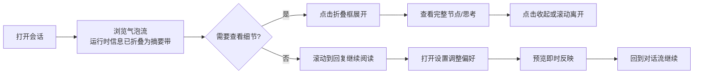
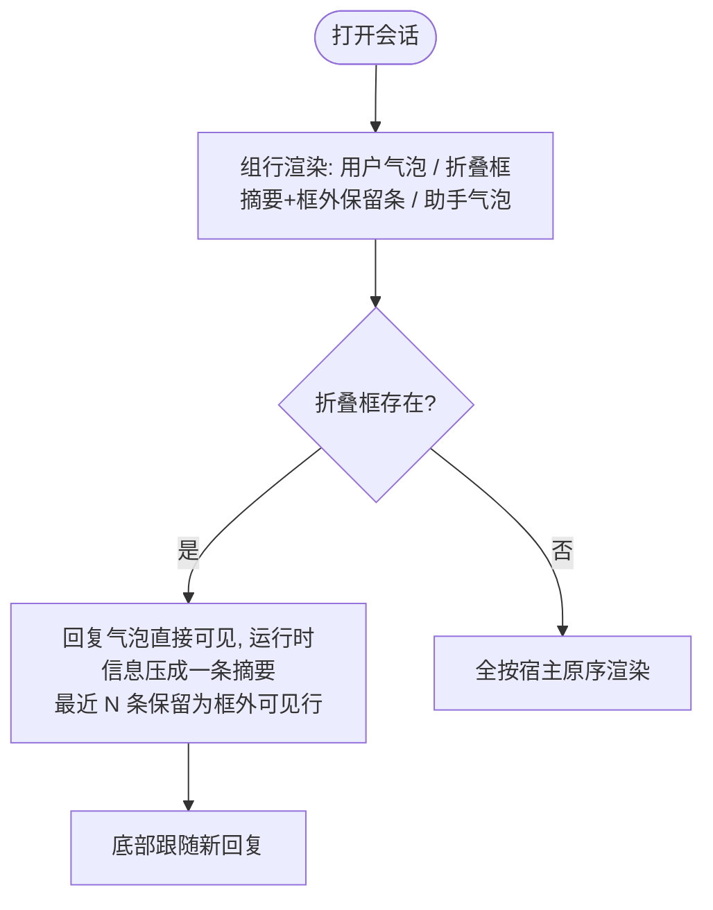
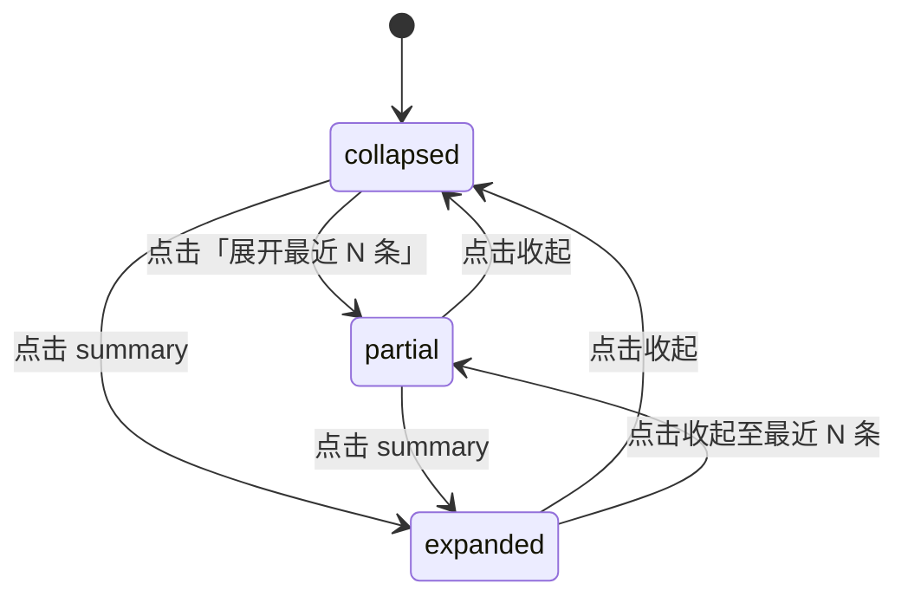
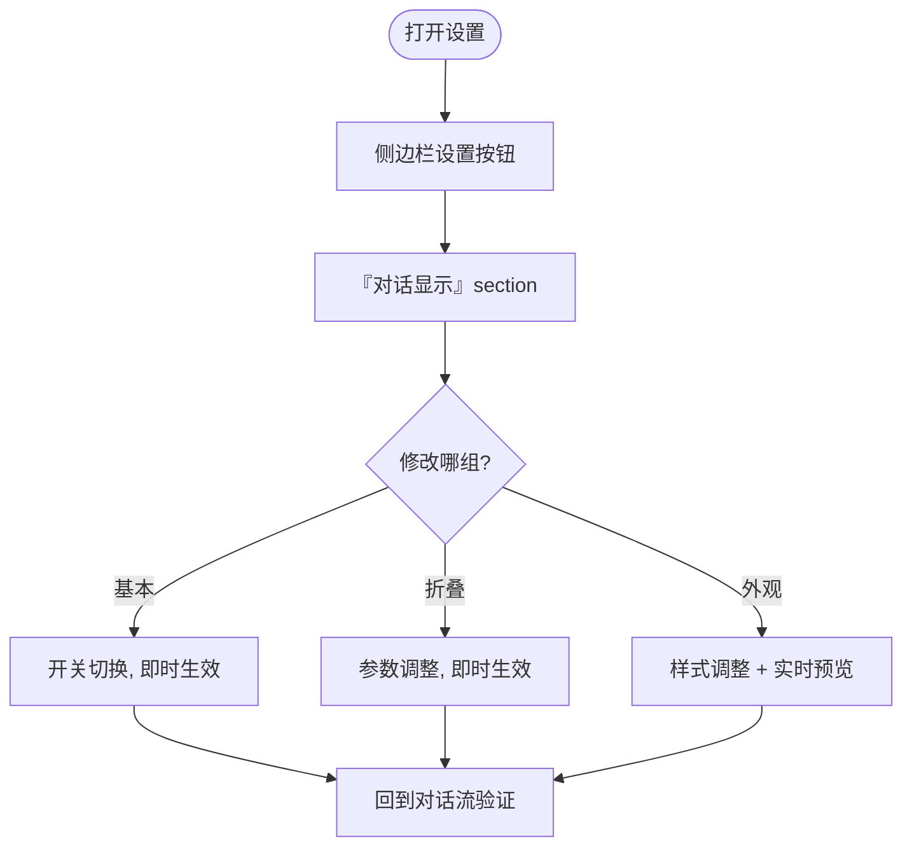

# 交互设计 - dsh-chat-focus - 任务流程

## 文档信息

| 项目 | 内容 |
|------|------|
| 创建日期 | 2026-08-16 16:05 |
| 任务类型 | 阅读对话流 / 展开折叠框 / 配置设置（UI+交互设计混用轨道） |
| 状态 | 草稿 |

---

## 1. 任务清单与场景（IA-L1）

| 任务ID | 任务名称 | 触发条件 | 用户目标 | 优先级 |
|--------|---------|---------|---------|--------|
| T1 | 阅读对话流 | 打开会话 | 快速读到正式回复，跳过运行时信息 | P0 |
| T2 | 查看运行时细节 | 需要核对工具/思考过程 | 展开折叠框看到完整节点 | P0 |
| T3 | 配置插件 | 调整显示偏好 | 总开关/气泡/折叠参数即时生效 | P1 |
| T4 | 追溯旧会话 | 打开历史会话 | 折叠框状态与锚点稳定，不丢失阅读位置 | P1 |

## 2. 用户旅程（端到端）

## 3. 关键任务流程

### 3.1 T1 阅读对话流

- 反馈：无加载态；折叠框默认收起（foldDefaultOpen=false）；流式回复到达时底部跟随（宿主逻辑）；
- 框外保留条始终可见（M3 §2.2：不随折叠框状态变化）；
- 失败：设置不可用 → 按默认值渲染；节点缺失 → 跳过该行。

### 3.2 T2 展开/收起折叠框

- 反馈：展开动画 ≤200ms（宿主动效节奏）；流式追加不重置展开态；
- 持久化：localStorage 按组 anchorKey（L2-17）；
- 失败：组内单节点渲染错误 → JsonBlock fallback；localStorage 不可用 → 会话内生效。

### 3.3 T3 配置设置

- 反馈：写成功静默；写失败保留当前值，下轮订阅校正；namespace 不可用 → 页面只读降级提示；
- 即时性：所有控件变更不经保存按钮，直接 `settingsScope.set` + 订阅推送。

## 4. 反馈清单（IA-L4）

| 反馈ID | 触发场景 | 类型 | 方式 | 持续 |
|--------|---------|------|------|------|
| FB-1 | 设置写成功 | 正向 | 静默（无提示） | 即时 |
| FB-2 | 设置写失败 | 负面 | 控件值回滚（下轮订阅校正） | 至下次变更 |
| FB-3 | 折叠框展开/收起 | 状态 | 内容展开动画 ≤200ms | 即时 |
| FB-4 | namespace 不可用 | 状态 | 设置页只读提示 + 默认值运行 | 持续 |
| FB-5 | 插件总开关关闭 | 状态 | 对话流回到宿主原序渲染 | 持续 |

## 5. 异常与边缘场景（IA-L5）

| 场景 | 触发条件 | 处理 |
|------|---------|------|
| 极端长运行时组（>1000 节点） | 超长任务 | 虚拟列表常数级渲染（M4） |
| 流式更新与展开态冲突 | 展开中追加节点 | 追加可见，不重置滚动/状态 |
| 分页加载更早历史 | loadOlder | prepend 后组序列重算，锚点键保位 |
| 会话切换/刷新 | 视图重挂载 | 滚动位置恢复（宿主 chatScroll）、折叠态 localStorage 恢复 |
| 深色模式 | 主题切换 | 全部经宿主 token 自动跟随 |

---

## 6. 决策记录

| 序号 | 时间戳 | 决策点 | 方案A | 方案B | 方案C | 用户选择 | 选择理由 |
|------|--------|--------|-------|-------|-------|----------|----------|
| 17-19 | 16:03 | 引用 M3 L2 决策 | — | — | — | 见模块3 | 交互与 UI 决策同源 |
| 20 | 18:11 | 展开动画时长 | 无动画（即时切换） | ≤200ms 淡入/高度过渡 | 400ms 弹性动画 | ≤200ms 淡入/高度过渡 | 与宿主节奏一致，长列表展开不卡顿 |
| 21 | 18:11 | 摘要行点击热区 | 整行可点（details 默认） | 摘要行 + 按钮双热区 | 仅按钮可点 | 摘要行 + 按钮双热区 | details 原生整行 toggle 保留，按钮提供部分展开/收起，两者互不冲突（按钮 stopPropagation） |
