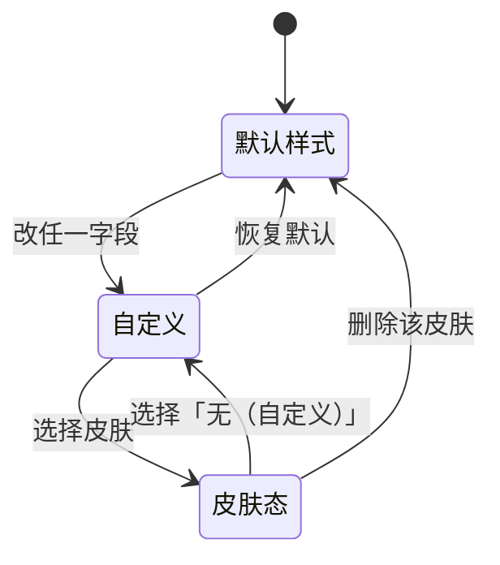
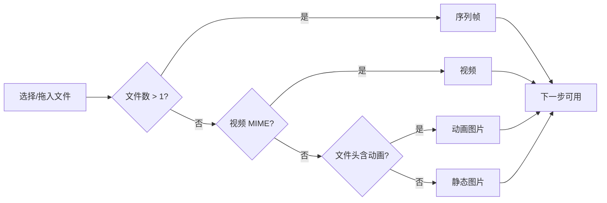
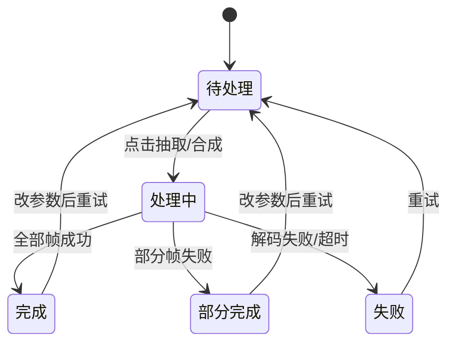
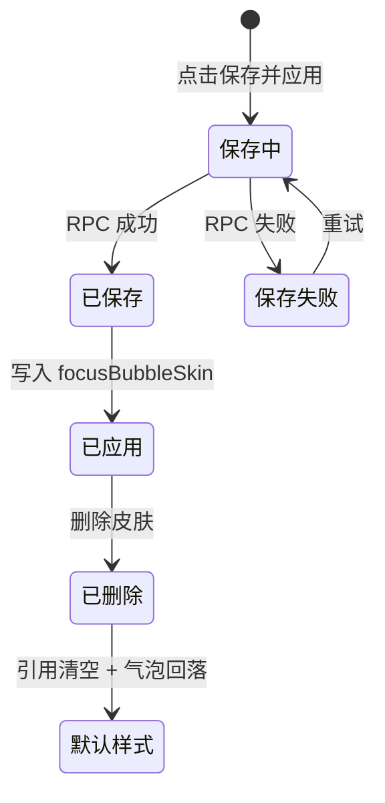

# 交互设计 - dsh-chat-focus - 气泡皮肤与设置操作流程

> G4 门禁交付物（体验轨）。与 code-design 的系统状态机/接口契约对齐。

## 文档信息

| 项目 | 内容 |
|------|------|
| 创建日期 | 2026-09-09 |
| 上游 | feature-design（FEAT-101~112）、ui-design |
| 状态 | 已定稿（G4） |

---

## IX-1 气泡外观调节（FEAT-101/102/108）

| 操作 | 反馈 | 时延 |
|------|------|------|
| 拖动不透明度滑块 | 预览区与真实气泡**即时**跟随（本地 draft） | ≤1 帧 |
| 松开滑块 | 一次设置写入（宿主回执后校正） | 100~300ms |
| 切换毛玻璃/适配/对齐 | 立即重绘 | ≤1 帧 |
| 皮肤选择变化 | 该侧气泡立即换肤；底纹小节置灰 + 说明条 | ≤1 帧 |
| 恢复默认 | 该侧全部字段回落默认；皮肤引用一并清空 | ≤1 帧 |

**失败反馈**：设置写入被宿主拒绝时，界面保留用户输入并在该行下方显示一行红色说明（不弹窗、不回滚已生效的本地镜像，等待下一次回执校正）。

## IX-2 素材识别（FEAT-103）

| 情况 | 反馈 |
|------|------|
| 文件超限（>16MB / >60 帧） | 该文件被拒，红色提示附具体原因，其余文件仍可继续 |
| 无法解码 | 提示「无法解码此文件」，不进入下一步 |
| 拖拽悬停 | 拖拽区高亮边框 |
| 序列帧排序 | 拖拽手柄排序；文件名自然序（`frame2 < frame10`）为默认 |

## IX-3 抽帧与合成（FEAT-104/105）

| 规则 | 说明 |
|------|------|
| 进度反馈 | 「第 i/N 帧」+ 进度条；每帧之间 `await` 让出主线程 |
| 取消 | 处理中「取消」可中止；已抽帧释放，回到「待处理」 |
| 超时 | 单帧 seek 超时 5s → 中止并提示 |
| 部分失败 | 跳过失败帧并在完成提示中列出（序列帧场景） |
| 参数变更 | 参数变更使已产出失效，回到「待处理」并保留旧预览供对比 |

## IX-4 切片编辑（FEAT-106）

| 操作 | 反馈 |
|------|------|
| 拖拽参考线 | 预览三档气泡同步重绘（≤1 帧） |
| 输入越界数值 | 夹取到合法范围，输入框回显夹取后的值 |
| 点击「按内容自动估算」 | 依据素材四角 alpha 通道估算内缩量，填入四个输入框 |
| 动态图片 / 精灵 / 视频类素材 | 切片步自动切换为「整层」形态（参考线禁用），改用圆角 + 适配 |

## IX-5 保存/应用/删除（FEAT-107/109）

| 规则 | 说明 |
|------|------|
| 顺序 | **先保存素材，成功后才写设置字段**（避免悬挂引用） |
| 删除被引用皮肤 | 确认弹层提示「该皮肤正被 X 使用」→ 确认后清引用 + 删除 |
| 宿主不可用 | 制作器入口禁用，hover 显示「皮肤库不可用：未连接到宿主」 |
| 皮肤列表加载中 | 骨架占位；失败显示重试按钮 |
| 应用目标「两者」 | 一次写两个字段（助手 + 用户） |

## IX-6 设置页签切换（FEAT-110）

| 操作 | 反馈 |
|------|------|
| 点击页签 | 内容区切换 + 底部预览切换；页签内容滚动位置各自保留 |
| 键盘 | 左右方向键切换页签；`Home`/`End` 跳首尾；页签为 `role="tablist"` 语义 |
| 关闭再打开 | 回到「通用」页（不持久化） |

## IX-7 回归交互（不得变化）

| 交互 | 约束 |
|------|------|
| 折叠框展开/收起 | 行为、localStorage 键、动画时长不变 |
| 气泡内代码块/表格横向滚动 | 不受底纹层重构影响 |
| 消息图片、引用、复制等图标操作 | 位置与行为不变 |
| 设置页固定预览 | 滚动行为不变（`paneHeight` 测量逻辑保留） |

## IX-6′ 左标签栏切换与批量操作（FEAT-110/112，2026-09-09 用户裁决后）

| 操作 | 反馈 |
|------|------|
| 点击左标签栏 | 中间表单切换，右侧预览按标签内容切换；各标签的滚动位置独立保留 |
| 键盘 | 宽屏 ↑/↓、窄屏 ←/→ 切换标签；`Home`/`End` 跳首尾；标签栏为 `role="tablist"`，选中项 `aria-selected` |
| 气泡外观「编辑哪一侧」 | 分段开关切换后，同一套控件改为编辑另一侧，预览同步切换 |
| 「复制到另一侧」 | 一次原子写入；按钮即时生效，无确认弹层（可再复制回来） |
| 「恢复全部默认设置」 | 二次确认（`确认恢复` / `取消`）；确认后气泡、折叠、皮肤全部回到初始值 |
| 关闭再打开设置 | 回到「基础」标签（不持久化） |

## IX-7′ 视频路线选择（FEAT-111）

| 操作 | 反馈 |
|------|------|
| 处理方式切到「直接使用视频」 | 立即探测视频元数据并显示循环预览；失败时停留并显示原因 |
| 切回「抽帧合成精灵图」 | 清空已生成的直用资产，回到抽帧参数表单 |
| 视频超过 8MB | 保存被宿主校验拒绝，制作器停在保存步并显示原因 |
| 气泡进入/离开视口 | 进入即播放、离开即暂停（不显示任何控件或提示） |
