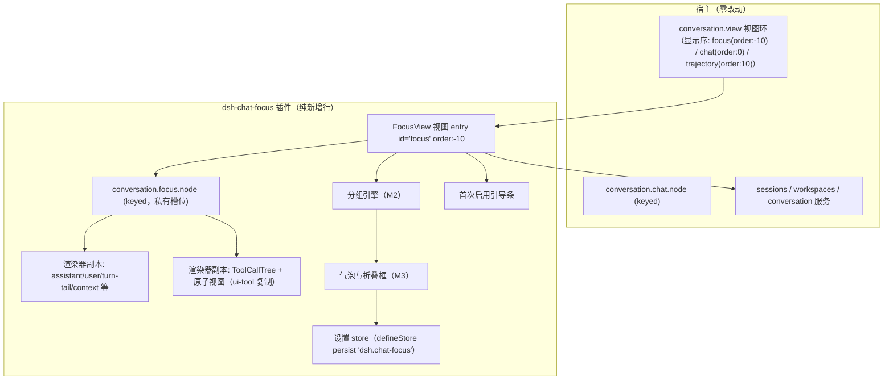

# 方案设计 - dsh-chat-focus - 备选方案：视图附加型

## 文档信息

| 项目 | 内容 |
|------|------|
| 文档版本 | v1.0.0 |
| 创建日期 | 2026-08-16 18:40 |
| 方案类型 | 备选方案（主方案为 fork 替换型，见总规划与 M1-M5） |
| 状态 | 备选（决策 24 定案：fork 版为主，本文档保留备用） |
| 触发条件 | 零手术硬约束、卸载/更新鲁棒性优先、宿主进入语义化版本（1.0+）后 |

---

## 1. 方案概述

**视图附加型**：插件作为普通 dsh.client 行挂载（不禁用任何宿主行、不改任何宿主配置），在宿主 `conversation.view` 视图环中注册**新视图标签「简洁」**，复制宿主 chat 渲染层与 ui-tool 工具树并改造为折叠+气泡视图。宿主原生对话视图（Chat）与插件视图共存。

### 1.1 核心机制依据（已实测宿主源码）

| 事实 | 宿主代码位置 | 结论 |
|------|-------------|------|
| `conversation.view` 是 list 槽位，多 entry 合法 | ui-conversation/apply.ts L376-426（chat order:0）；ui-trajectory 第二个 entry 先例 | 插件注册新 entry id='focus' 合规 |
| list 槽位按 order 升序稳定排序，负数合法 | ui-slots/src/index.ts L850、L866-868 | 插件注册 `order: -10` → **标签栏排第一**（简洁 \| Chat \| Trajectory） |
| 默认视图回退硬编码 'chat' | ui-conversation/skeleton/ConversationSession.tsx L23-30 `DEFAULT_VIEW_ID = 'chat'` | **排第一≠默认选中**；首次需用户点一次标签（选择持久化于宿主 chatStore，刷新/重开保持） |
| 槽位声明冲突规则 | packages/client/AGENTS.md「declaring one someone else declared, fails at load」 | 插件必须声明私有槽位名，不能复用宿主 'conversation.chat.node' |
| 设置命名空间白名单 | host/apiproxy/src/api-proxy.ts L126-128 `WEB_SETTINGS_NAMESPACES` | 插件设置**不依赖宿主命名空间**，用 defineStore persist（localStorage） |
| 宿主服务仍可用 | fork 未禁行，sessions/workspaces/conversation 服务存活 | loadOlder/openFile/loadImage 可直接注入使用 |

### 1.2 架构

### 1.3 插件私有槽位清单（全部不与宿主冲突）

| 新槽位 | kind/scope | 用途 |
|--------|-----------|------|
| conversation.focus.node | keyed/session | 节点渲染分发（宿主 'conversation.chat.node' 的副本） |
| conversation.focus.node.turnTail | chain/session | 回复脚注 |
| conversation.focus.node.assistant-actions | list/session | 助手消息操作条 |
| focus.tool.call.toolview | keyed/session | 工具原子视图分发（宿主 'tool.call.toolview' 的副本） |

> 已知限制：宿主贡献（ui-deliverables 的产出文件行、ui-message-feedback 的赞踩条）注册在宿主的 'conversation.chat.turnTail'/'conversation.chat.assistant-actions' 槽位下，**不会进入插件私有槽位**——v0.1 该两处渲染为空/精简版；右侧 details 面板联动与轨迹视图 inspect 依赖宿主内部 store（插件不可达），v0.1 不提供（见 §5 stub）。

### 1.4 设置

- 存储：插件自有 `defineStore`（persist 'dsh.chat-focus'，localStorage；配额/隐私模式静默降级为内存态——宿主 store 同款语义）；
- 设置页：注册 `settings.section`（id=chat-focus，『对话显示』），与主方案 M5 相同的三组面板与字段（enabled/bubbles/foldKeepVisible/foldDefaultOpen/foldSummary/foldStrategy/bubbleStyle/foldReasoning + guideDismissed）；
- 不写宿主设置命名空间（白名单不可达；'ui-conversation' 命名空间已由宿主注册，重复注册会 throw）。

### 1.5 默认视图引导（排第一后的体验补齐）

- 标签位置：`order: -10` 排第一；
- 引导条：FocusView 首次挂载且 `guideDismissed=false` 时，视图顶部显示一次性引导条「已启用简洁视图，标签已置顶，点击即切换」，可关闭（写 store）；README 同步说明；
- 默认选中：无法由插件改变（宿主硬编码 'chat' 回退），首次点击不可避免；点击后宿主 store 持久化，此后默认即为简洁视图。

---

## 2. 与主方案（fork 替换型）对比矩阵

| 维度 | 主方案：fork 替换型 | 备选：视图附加型 |
|------|--------------------|-----------------|
| 宿主源码 | 不改 | 不改 |
| 宿主行/配置 | 禁用 ui-conversation 1 行（bundle 补丁层） | 纯插入 1 行，不禁用任何行 |
| 默认视图 | 开箱即用（fork 即默认 chat 视图） | 首次需点一次标签（之后持久化）；可排第一 + 引导条 |
| 渲染器 | 宿主 ui-tool 自动注册进 fork 同名槽位，**零复制** | 复制 chat 渲染层 ~15 文件 + ui-tool ~24 文件，**全部改槽位名** |
| 宿主贡献保留 | 100%（工具树/产出文件行/赞踩条/details/inspect） | 工具树可复制；产出文件行/赞踩条/details/inspect **缺失**（v0.1） |
| 设置 | 宿主设置文件（跨设备同步；扩展 'ui-conversation' 命名空间，白名单已放行） | localStorage（本机浏览器；宿主命名空间不可达） |
| 宿主升级适配面 | 全接缝（18 槽位 + 服务 + 数据模型），契约漂移可能**加载失败** | 仅渲染器副本（chat 层 + ui-tool 层），过时仅**静默差异**，宿主视图兜底 |
| 卸载 | 移除 bundle 引用 → 禁用行自动恢复；设置文件残留 8 个无用字段（schemastery 非严格模式放行，无害） | 删行即卸；localStorage 设置键残留（无害） |
| 维护成本 | 低（渲染器零复制）但适配面全 | 高（双份渲染器各自漂移）但适配面小一半 |
| 排障 | 需理解补丁叠层概念 | 单行插件，直觉排障 |
| 适合场景 | 追求完整功能与默认替换，接受配置层"禁行" | 零手术硬约束、更新/卸载鲁棒性优先、宿主 1.0 后 |

### 2.1 更新兼容性结论（备选方案的相对优势）

宿主当前处于 pre-release（AGENTS.md：foundation over blast radius，契约随时可能漂移）：
- fork 版：宿主升级若动契约接缝 → 可能加载失败，需 fork 发新版适配（响亮、可测）；
- 视图附加版：宿主升级几乎不影响插件加载（宿主行活着），副本过时仅影响插件视图自身表现，切回宿主标签即恢复——**鲁棒性更高**，但功能跟随滞后。

### 2.2 卸载结论（两方案均干净）

- fork 版：bundle 补丁层天然可回滚（移除 bundle 引用即恢复宿主行）；设置文件残留字段无害（schemastery object 非严格模式 `merge(result, data)` 放行未知键，vendor/schemastery/src/index.ts L752-763）；视图选择残留由宿主 `resolveActiveView` 自动回退；
- 视图附加版：删行即卸，残留仅 localStorage 键。

---

## 3. 决策记录

| 序号 | 时间戳 | 决策点 | 方案A | 方案B | 方案C | 用户选择 | 选择理由 |
|------|--------|--------|-------|-------|-------|----------|----------|
| 22 | 18:25 | 架构切换（中途考量） | 视图附加+紧凑渲染器 | 视图附加+完整渲染器 | 保持 fork 替换 | 视图附加+完整渲染器 | 用户一度倾向零手术；后经更新兼容性与卸载对比，回到 fork 版（决策 24） |
| 23 | 18:25 | 默认视图引导 | 无引导 | 首次启用引导条 | 直写宿主持久化键（不推荐） | 首次启用引导条 | 引导条 + 标签排第一补齐默认视图体验 |
| 24 | 18:40 | 方案定案 | fork 替换型（主方案） | 视图附加型（备选） | — | fork 替换型（主）+ 视图附加型（备选文档） | 用户确认：fork 版为主，视图附加版作为备选写入文档 |

---

## 4. 切换触发条件（何时启用本备选）

满足任一即建议切换到视图附加型：
1. **零手术硬约束**：不允许对宿主行做任何禁用/配置变更；
2. **更新鲁棒性优先**：宿主升级频繁且无专人维护适配（pre-release 阶段）；
3. **卸载/回滚敏感**：要求删行即卸、无任何配置层操作；
4. 宿主发布 1.0 语义化版本后，契约稳定，视图附加的复制成本可控。

切换时的工作增量：渲染器复制 + 槽位改名（M1 重写为渲染器复制域）、FocusView 注册（M4 重写）、设置改 defineStore（M5 局部）、引导条新增；分组引擎（M2）、气泡折叠框（M3）与主方案共用，无需重做。

## 5. stub 清单（原则7）

| stub 位置 | 用途 | 消除里程碑 | 消除方案 |
|-----------|------|-----------|---------|
| turn-tail 贡献缺失 | 宿主 ui-deliverables 注册进宿主槽位，插件私有槽位无贡献 | v0.1 发布时声明为已知限制；**消除版本暂不承诺**（依赖宿主是否导出槽位贡献） | 复制 TurnTailNodeView + 自建产出文件行渲染（或请求宿主导出槽位贡献） |
| 赞踩反馈条缺失 | 宿主 ui-message-feedback 同上 | v0.1 发布时声明为已知限制；**消除版本暂不承诺**（依赖同上） | 同上思路 |
| details/inspect 联动缺失 | 宿主 chatStore 句柄不可达 | v0.2 评估（仅评估，不承诺） | 插件自带内联工具详情（复制 ToolDetails 变体）或请求宿主开放 store 注入通道 |
| 引导条 | 首次启用提示 | v0.1 发布前 | guideDismissed 字段 + 一次性渲染 |
