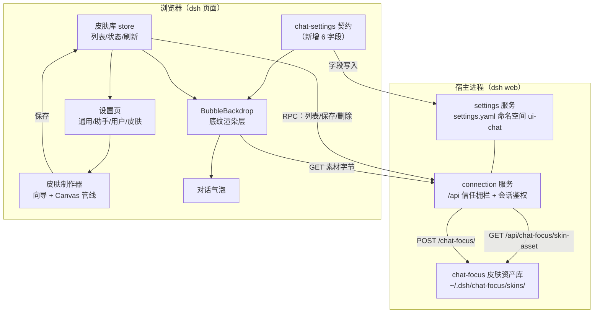

# 方案设计 - dsh-chat-focus - 气泡皮肤增量

> G3 门禁交付物。每个效果类决策点给出三套**实质差异**方案，按「重实现效果、轻技术选择」原则选定并记录。
> 正文只保留选中方案；废弃方案仅以单行摘要留存在决策记录表中。

## 文档信息

| 项目 | 内容 |
|------|------|
| 创建日期 | 2026-09-09 |
| 上游 | [feature-design](feature-design-20260909-dsh-chat-focus-气泡皮肤增量.md)（FEAT-101~112） |
| 状态 | 已定稿（G3） |
| 调研时间 | 2026-09-09（CSS 九宫格/精灵动画、宿主 connection seam、浏览器媒体解码能力） |

---

## 1. 系统组合运行视图（七项原则 1，强制前置）

**关键运行路径**

| # | 路径 | 说明 |
|---|------|------|
| R1 | 设置页改底纹不透明度 → `settings.yaml` → 气泡底纹层 | 即时生效（本地镜像先写、宿主回执后校正） |
| R2 | 制作器保存皮肤 → RPC → 磁盘 → 皮肤库 store 刷新 → 气泡换肤 | 保存成功后才写 `focusBubbleSkin` |
| R3 | 气泡渲染 → 皮肤库 store 命中 id → 素材 URL → 底纹层绘制 | 素材 URL 带 `v` 版本戳，可长缓存 |
| R4 | 宿主无 `connection`（能力探测失败）→ 皮肤库置 `unavailable` | 制作器入口禁用并说明；静态内联背景图片不受影响 |

**失败路径**（原则 4）

| 失败 | 表现 |
|------|------|
| 素材 404/解码失败 | 气泡回落无皮肤样式，控制台一次告警，不阻断会话 |
| RPC 保存失败 | 制作器停在保存步并显示原因，不写设置 |
| 皮肤被删除但仍被引用 | 删除流程同时清空引用；渲染端再兜底回落 |
| 抽帧超时 | 中止并释放 video/canvas，提示重试 |

## 2. 方案对比与选定

### 2.1 底纹透明实现（FEAT-101/102）

| 方案 | 实现效果 | 代价 |
|------|----------|------|
| A 仅开放 rgba 文本输入 | 只有能手写 CSS 的用户可用；颜色选择器不支持 alpha | 改动最小 |
| B **独立底纹层 + 整层不透明度 + 毛玻璃** | 颜色/图片/渐变共享一个不透明度，语义统一；文字始终不透明；可叠加毛玻璃 | 气泡 DOM 多一层 |
| C 整泡 `opacity` | 文字一起变淡，不可读 | 最小但效果错误 |

**选定 B**。底纹层是后续皮肤渲染（精灵/视频/九宫格）的天然载体，一次重构覆盖两个功能域。

### 2.2 九宫格渲染机制（FEAT-106/108）

| 方案 | 实现效果 | 代价 |
|------|----------|------|
| A 全量 `border-image` | 原生九宫格、区域裁剪正确；**不支持动画图片**（只播首帧），忽略 `border-radius` | 一行 CSS |
| B **静态图 `border-image` 九宫格 + 动态素材整层绘制** | 静态皮肤获得原生九宫格质量；GIF/APNG 与精灵走整层背景，动画正常播放 | 两条渲染路径 |
| C 9 层 `background-image`（每层一个区域） | **不可行**：`background-image` 各层绘制的是整张图，`background-size/position` 只做缩放与定位，不做区域裁剪——9 层会重复绘制整图 | — |

**选定 B**。调研结论：CSS 中唯一能做「单图九宫格裁剪」的原生机制是 `border-image`；
`background-image` 无法按区域裁剪（除非预先裁成 9 张图）。因此按素材是否可动画分流：
**静态图 → 九宫格切片；动态图/精灵 → 整层（拉伸/覆盖）+ 圆角裁剪**。
这也与 QQ/微信一致：静态气泡按九宫格拉伸，动态气泡是整泡动态图。

### 2.3 动态素材路线（FEAT-104/105）

| 方案 | 实现效果 | 代价 |
|------|----------|------|
| A 仅 GIF/APNG 原样使用 | 视频/序列帧用户无路可走 | 最省 |
| B 统一转码 APNG | 单一格式；但浏览器无原生 APNG 编码，需引入编码器依赖 | +依赖体积 |
| C **视频/序列帧 → 横向精灵图 + `steps()` 步进动画** | 零新增依赖；帧数/帧宽可控；APNG 作为**输入**原样使用 | 需抽帧与合成代码 |

**选定 C**。视频是**输入格式**而非运行时格式：制作时抽帧固化为精灵图，运行时只有「图片」与「精灵」两种素材。

### 2.4 素材存储（FEAT-109）

| 方案 | 实现效果 | 代价 |
|------|----------|------|
| A 内联 data URI 进 settings.yaml | 与设置同源；但数百 KB~数 MB 单行字符串撑爆设置文件、拖慢每次写入 | 零改动 |
| B 浏览器 IndexedDB | 无宿主改动；但不清站点数据才在，跨浏览器不共享 | 中 |
| C **宿主资产库 + 受鉴权 GET 路由 + RPC 写入** | 与宿主设置同源持久化、跨浏览器可用、素材不进设置文件 | 宿主半 +约 250 行 |

**选定 C**。宿主 `connection` 是官方扩展 seam（`rpc.handle` 写 / `fetch.register` 读，均在 `/api` 信任栅栏与浏览器鉴权之后），不构成新的鉴权面，也不修改宿主源码。

### 2.5 皮肤与既有字段的优先级（FEAT-108）

| 方案 | 实现效果 | 代价 |
|------|----------|------|
| A 皮肤只叠加在现有背景之上 | 语义混乱，图片与皮肤打架 | 最小 |
| B **皮肤独占底纹层**（皮肤激活时 bg/图片/渐变/圆角/边框 不参与渲染，UI 置灰说明） | 一处生效、所见即所得 | 需 UI 状态联动 |
| C 皮肤与字段逐项可覆盖 | 灵活但组合爆炸、难以解释 | 高 |

**选定 B**。文字颜色/字体/字号保持独立可调（皮肤未定义时用用户值）。

### 2.6 设置信息架构（FEAT-110）

| 方案 | 实现效果 | 代价 |
|------|----------|------|
| A 维持单页长滚动 | 40+ 行，查找成本高 | 零 |
| B **顶部四页签 + 组内折叠 + 底部随页签切换的预览**（已被 D6′ 取代） | 每次只看一类；预览始终相关 | 需拆分 845 行文件 |
| C 拆成多个 `settings.section` 页 | 侧栏导航项变多，跨页对比难 | 中 |

**选定 B**。

## 3. 决策记录表

| 序号 | 时间戳 | 决策点 | 方案A | 方案B | 方案C | 选择 | 理由 |
|------|--------|--------|-------|-------|-------|------|------|
| D1 | 2026-09-09 | 底纹透明实现 | rgba 文本输入 | 独立底纹层 + 整层不透明度 + 毛玻璃 | 整泡 opacity | **B** | 一次重构同时支撑不透明度与皮肤渲染；文字不受影响 |
| D2 | 2026-09-09 | 九宫格机制 | 全量 border-image | 静态 border-image + 动态整层 | 9 层 background-image | **B** | 静态九宫格用原生裁剪；动态素材保留动画；C 经调研不可行 |
| D3 | 2026-09-09 | 动态素材路线 | 仅 GIF/APNG | 统一转 APNG | 精灵图 + steps() | **C** | 零新增依赖；视频作为输入固化；帧数可控 |
| D4 | 2026-09-09 | 素材存储 | settings 内联 | IndexedDB | 宿主资产库 + 鉴权路由 | **C** | 与宿主设置同源持久化、跨浏览器可用、设置文件不膨胀 |
| D5 | 2026-09-09 | 皮肤字段优先级 | 叠加 | 皮肤独占底纹层 | 逐项可覆盖 | **B** | 一处生效、语义清晰、UI 可解释 |
| D6 | 2026-09-09 | 设置信息架构 | 单页长滚动 | 四页签 + 组内折叠（→ 见 D6′） | 多 section 拆页 | **B** | 纵向长度与认知负担下降，预览保持相关 |
| D7 | 2026-09-09 | 精灵动画实现 | background-position 百分比 | 子元素 `transform: translateX` + `steps(N-1)` | JS 定时器逐帧 | **B** | 百分比语义在超宽背景上易错；transform 语义精确、GPU 合成、无 JS 逐帧开销 |
| D8 | 2026-09-09 | 皮肤素材种类 | 仅图片 | 图片 + 精灵（→ 见 D8′） | 图片 + 精灵 + 实时视频 | **B** | 实时视频每泡一个解码器、破坏可移植性；抽帧已覆盖动态需求 |

## 4. 技术调研结论（2026-09-09）

| 结论 | 来源/依据 |
|------|-----------|
| **`background-image` 各层绘制整张图、不做区域裁剪**，单图九宫格只能用 `border-image` | CSS 规范：每层 background 的 `background-size/position` 仅做缩放与定位 |
| **`border-image-slice` 取源图像素（无单位数值）**，写 `18px` 会被判非法并静默丢弃（回落默认 `100%`，九宫格失效）——实现期实测修正 | 浏览器计算样式实测（2026-09-09 隔离 dsh 实例验证） |
| 动画 GIF/APNG 在 `background-image` 中正常播放；`border-image` 只绘制首帧（不参与动画重绘） | Chromium 实现现状（border-image 未接入动画图像重绘） |
| `steps(N-1)` 配合 `translateX(-(N-1)/N × 100%)` 恰好给出 N 个帧位 | 步进函数离散值推导（见 code-design §4.3） |
| 宿主 `connection.rpc.handle(channel, handler)` 提供带鉴权的前缀 RPC（channel 为单段路径）；`connection.fetch.register` 仅支持 GET/HEAD 精确路径且必须位于 `/api/` 下 | `packages/client/connection/src/rpc.ts`、`rpc-host.ts` |
| 宿主设置文档为 YAML 叶子级 diff 写回，大字符串会拖慢每次写入 | `packages/settings/settings-file/src/index.ts` |
| `client-hmr` 监听客户端 bundle 重建，`lib/client.js` 变更可热更新；宿主半变更需重启 dsh | `packages/bundle/web-app/cordis.patch.yml:148` |

---

## 5. 变更记录（WF-006 回溯，2026-09-09 用户裁决）

设计定稿（G5）之后，用户对两个效果类决策点给出了与初版不同的裁决。按回溯机制：先改源头（本文件决策记录 + feature-design 功能清单），再全量传播到 UI/交互/代码/测试，最后重验门禁。

### D6′ 设置页形态：顶部四页签 → 左标签栏 + 右侧固定预览

| 项 | 内容 |
|----|------|
| 时间 | 2026-09-09 09:25（用户答复） |
| 原决策 | D6 = B（顶部四页签：通用 / 助手气泡 / 用户气泡 / 皮肤 + 底部固定预览） |
| 变更后 | **左标签栏 + 右侧固定预览，五个标签：基础 / 折叠 / 气泡外观 / 皮肤 / 高级**；气泡外观用「助手 / 用户」分段开关复用同一编辑器，并提供「复制到另一侧」；高级页承载恢复全部默认、皮肤库状态与资产路径 |
| 理由 | 纵向长度与认知负担进一步下降：每侧 19 项不再各占一个页签，同类项只出现一次；右侧常驻预览让「改哪一侧」的对比更直观 |
| 传播 | feature-design FEAT-110 重述 + FEAT-112（批量操作）+ ui-design + interaction-design IX-6 + code-design §5 + 实现（ChatFocusSection 重写、BasicPanel/FoldPanel/AppearancePanel/AdvancedPanel 拆分、`ChatFocusPolicy.setFields` 原子写） |
| 重验 | G3/G4/G6 ✅ |

### D8′ 动态素材：仅图片+精灵 → 增加运行时视频图层

| 项 | 内容 |
|----|------|
| 时间 | 2026-09-09 09:25（用户答复） |
| 原决策 | D8 = B（图片 + 精灵；拒绝实时视频：每泡一个解码器、破坏可移植性） |
| 变更后 | **新增 `kind = 'video'`**：视频可「直接使用」，由静音循环 `<video>` 图层播放；抽帧精灵图保留为**默认**路线（体积小、零解码开销）。视频素材上限 8MB，且仅在气泡进入视口时播放、离开视口暂停 |
| 理由 | 用户明确要求「视频等动态格式支持」并选择分层合成路线；视口内播放把原决策担心的解码器开销压到可接受范围 |
| 传播 | feature-design FEAT-111 + skin-contract（`SkinKind` 加 `video`、mime 白名单加 `video/mp4`/`video/webm`、kind↔mime 一致性校验）+ skins/host（Range/206）+ detect.inspectVideo + BubbleBackdrop VideoLayer + SkinMaker 双路线 + 词条 + 单测 TC-23/24 |
| 风险 | 长会话大量视频气泡仍会吃 GPU/内存 → README 已知限制明示，制作器提示默认走抽帧 |
| 重验 | G2/G3/G6 ✅ |

### D9 资产路由支持 Range

| 项 | 内容 |
|----|------|
| 时间 | 2026-09-09 09:33 |
| 决策点 | 视频素材如何被媒体元素 seek/循环 |
| 方案 A | 整包返回（200）：小文件可播，但浏览器无法 seek，循环时可能重下整个文件 |
| 方案 B | **`Accept-Ranges: bytes` + 单区间 `206 Partial Content`（支持 `start-end` / `start-` / `-suffix`，越界回 416）** |
| 方案 C | 交给宿主静态文件服务：宿主没有面向插件资产的通用静态服务，需新增依赖 |
| 选择 | **B**。理由：约 40 行纯函数 + 一个响应分支，零依赖；`parseByteRange` 可单测 |
| 传播 | skins/host.ts + 单测 TC-25 |

### D5′ 皮肤应用语义：底纹独占 → 现有编辑功能的打包套用（2026-09-09 14:42 用户裁决）

| 项 | 内容 |
|----|------|
| 时间 | 2026-09-09 14:42（用户裁决，与 D10 同轮） |
| 原决策 | D5 = B（皮肤独占底纹层，bg/图片/渐变/圆角/边框置灰） |
| 变更后 | **皮肤 = 现有编辑功能的打包 + 素材扩展**。制作器携带整套打包样式（背景色/渐变/边框/不透明度/毛玻璃/可读性遮罩/文字颜色/字体/字号，全部沿用现有字段语义），应用时与皮肤 id 一起**原子写入该侧的现有设置字段**（模板语义：套用后一切可继续微调）；渲染时皮肤只接管素材与其几何（九宫格切片、圆角、内边距） |
| 理由 | 制作器不是另一套样式系统：把现有编辑能力打包进可复用记录，避免"两套样式系统"的认知分裂 |
| 传播 | skin-contract `SkinStyle` + 校验（缺省回退默认值）+ 宿主旧记录归一化 + chrome `skinStylePatch` + ChatBubble 接管缩小到 radius/padding + SkinsPanel/SkinMaker 原子套用 + 设置页置灰行减少 + 词条 |
| 重验 | G2/G3/G6 ✅（tsc + 三套测试） |

### D10 制作器实现方式：自研控件 → 复用现有编辑实现（2026-09-09 14:42 用户裁决）

| 项 | 内容 |
|----|------|
| 时间 | 2026-09-09 14:42（用户裁决） |
| 决策点 | 制作器的「切片与几何」「文字与预览」用什么实现 |
| 变更后 | **切片与几何**：弃用参考线拖拽的 `SliceEditor`，改用与背景图裁剪同源的 `ImageCropper` 交互（contain 舞台 + 可移动九宫格中心框 + 四边独立拖拽 + 三档实时预览），并保留「按内容自动估算」；**外观与文字**：新增一步，用共享控件（`GradientEditor`/`FontSelect`/`OpacitySlider`/`OverlaySlider` 下沉到 `controls.tsx`）编辑打包样式，初值从当前编辑侧种子带入 |
| 理由 | 向导骨架与 UI 保留（用户认可），但两步的内容与实现必须来自现有编辑功能，禁止平行实现 |
| 传播 | NineSliceCropper.tsx（新）、SliceEditor.tsx（删除）、controls.tsx（下沉）、BubbleSidePanel（改用共享控件）、SkinMaker（步骤/保存/预览） |
| 重验 | G4/G6 ✅ |
