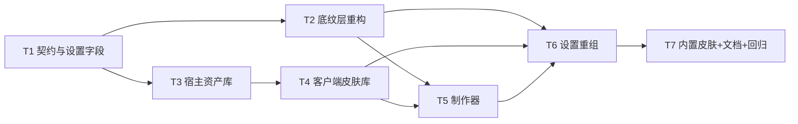

# 任务计划 - dsh-chat-focus - 气泡皮肤增量

> G7 门禁交付物。任务按依赖拓扑排序，每项含输入/输出/验收/风险；T1 无前置，T2~T7 依赖前序。

## 文档信息

| 项目 | 内容 |
|------|------|
| 创建日期 | 2026-09-09 |
| 上游 | code-design（G6 定稿） |
| 状态 | 已定稿（G7） |

---

## 任务总览

| ID | 任务 | 依赖 | 产出 | 验收 |
|----|------|------|------|------|
| T1 | 契约与设置字段 | — | `skin-contract.ts`、`chat-settings.ts` +6 字段 | `tsc --noEmit` 通过；schema 默认值可读回 |
| T2 | 底纹层重构 + 半透明/毛玻璃 | T1 | `ChatBubble.tsx/.css`、`BubbleBackdrop.tsx/.css`、`chrome.ts` | 默认视觉与旧版一致；不透明度/毛玻璃生效；TC-01~05 |
| T3 | 宿主资产库 | T1 | `skins/host.ts`、`index.ts` 安装 | RPC 四端点 + GET 路由可用；TC-19~21 |
| T4 | 客户端皮肤库 | T3 | `skins/registry.ts` | 列表/保存/删除/改名 + 降级；TC-14~16 |
| T5 | 制作器 | T2,T4 | `skins/detect.ts`、`skins/sprite.ts`、`SkinMaker.tsx`、`SliceEditor.tsx` | 四类素材走通；TC-06~13 |
| T6 | 设置重组 | T2,T4,T5 | `ChatFocusSection.tsx` 拆分 + 面板 + 词条 | 五标签可用（D6′ 后）；皮肤接管置灰；TC-22 |
| T7 | 内置皮肤 + 文档 + 回归 | T6 | `builtin-skins.ts`、README、测试 | 全量单测 + 构建通过；回归集全绿 |

---

## T1 契约与设置字段

| 项 | 内容 |
|----|------|
| 输入 | code-design §2、§4.2 |
| 步骤 | 1) 新建 `skin-contract.ts`（纯类型 + 常量 + `skinAssetUrl`） 2) `chat-settings.ts` 增 6 字段：`focusBubbleBackdropOpacity`/`focusUserBubbleBackdropOpacity`（number,100）、`focusBubbleBackdropBlur`/`focusUserBubbleBackdropBlur`（string,''）、`focusBubbleSkin`/`focusUserBubbleSkin`（string,''） |
| 验收 | 类型检查通过；`DEFAULT_CHAT_SETTINGS` 与 schema 默认一致 |
| 风险 | 新增字段必须向后兼容：旧 settings.yaml 缺键时由 schema 默认补齐 |

## T2 底纹层重构

| 项 | 内容 |
|----|------|
| 输入 | code-design §4.4 |
| 步骤 | 1) `ChatBubble` 结构改为 backdrop + body；2) `BubbleBackdrop` 支持 image/animated/sprite 三类；3) `chrome.ts` 透传 opacity/blur/skin；4) 精灵关键帧注入工具 |
| 验收 | 默认气泡与旧版像素级一致（截图对比）；不透明度 40 时透出背景；毛玻璃生效；皮肤三类渲染正确 |
| 风险 | DOM 结构变化可能影响既有 CSS 选择器 → 回归检查 markdown/代码块/表格样式 |

## T3 宿主资产库

| 项 | 内容 |
|----|------|
| 输入 | code-design §3 |
| 步骤 | 1) 目录解析与 index 读写（原子写）；2) 四端点 RPC；3) GET 素材路由；4) `src/index.ts` 用 `ctx.inject(['connection'])` 安装 |
| 验收 | `curl` GET 素材返回正确 MIME 与缓存头；RPC 保存后磁盘出现 `<id>.bin`；重启 dsh 后列表仍在 |
| 风险 | `connection` 未加载 → 必须静默跳过（不阻断插件加载） |

## T4 客户端皮肤库

| 项 | 内容 |
|----|------|
| 输入 | code-design §4.1 |
| 步骤 | 1) RPC 客户端（信封构造 + 响应校验）；2) `SkinRegistry` 状态机；3) 内置皮肤合并 |
| 验收 | 加载失败置 `unavailable` 并保留内置皮肤；保存/删除后状态即时更新 |
| 风险 | 页面刷新后需自动重载 → 在 `apply` 中触发一次 `load()` |

## T5 制作器

| 项 | 内容 |
|----|------|
| 输入 | code-design §5、ui-design §2、interaction-design IX-2~IX-4 |
| 步骤 | 1) `detect.ts` 文件头嗅探；2) `sprite.ts` 抽帧/合成；3) `SliceEditor`；4) `SkinMaker` 五步向导 + 实时预览 |
| 验收 | 四类素材各自走通并保存成功；抽帧有进度且可取消 |
| 风险 | 大视频抽帧卡顿 → 分片 await + 帧数上限；浏览器不支持 `ImageDecoder` 时不影响（仅用文件头嗅探） |

## T6 设置重组

| 项 | 内容 |
|----|------|
| 输入 | ui-design §1、interaction-design IX-6 |
| 步骤 | 1) 抽 `controls.tsx`；2) 拆基础/折叠/外观/皮肤面板（初始为 GeneralPanel，D6′ 后拆为 BasicPanel/FoldPanel/AppearancePanel/AdvancedPanel）；3) 壳层标签栏 + 预览切换；4) 词条补齐 |
| 验收 | 五标签切换正确（宽屏纵向 / 窄屏横向）；皮肤接管态置灰 + 说明；键盘可达 |
| 风险 | 现有 `paneHeight` 测量逻辑在页签结构下仍需成立 → 保持外层 DOM 层级不变 |

## T7 内置皮肤 + 文档 + 回归

| 项 | 内容 |
|----|------|
| 步骤 | 1) 3 套内置 SVG 皮肤（柔和蓝/玻璃拟态/暗夜）；2) README 中英文更新；3) 单测（geometry/detect/sprite 数学）；4) 全量回归 |
| 验收 | `pnpm run build` 通过；`pnpm run test:engine` 通过；浏览器实测通过；回归集全绿 |

---

## T8 变更落地（D6′/D8′/D9，2026-09-09 用户裁决后）

| 项 | 内容 |
|----|------|
| 输入 | solution-design §5 变更记录（D6′ 左标签栏 / D8′ 视频图层 / D9 Range） |
| 依赖 | T1~T7 全部完成 |
| 步骤 | 1) `skin-contract` 加 `video` kind + 视频 mime + kind↔mime 校验； 2) `skins/host` 资产路由加 `Range`/`206`/`416`； 3) `BubbleBackdrop` 加视频图层（视口内播放）+ 素材失败回落与一次性告警； 4) `SkinMaker` 视频双路线 + 起点/时长 + 源文件 16MB 上限 + 序列帧跳过提示； 5) 设置页改左标签栏 + 五标签 + 分段开关 + 复制到另一侧 + 高级页； 6) `SkinPolicy.setFields` 原子批量写； 7) 词条 + 单测 TC-23~25 + 文档回溯 |
| 产出 | 上述模块改动 + README 中英文 + 设计文档 §5/§6 变更记录 |
| 验收 | `typecheck` + `decl` + `bundle` 通过；`test:engine` / `test:skin` / `test:store` 全绿；TC-26/27 手工用例待真实浏览器复核 |
| 风险 | 两处结构改动（设置页、底纹层）触及既有回归面 → R-02/R-05/R-10 必须复核 |
