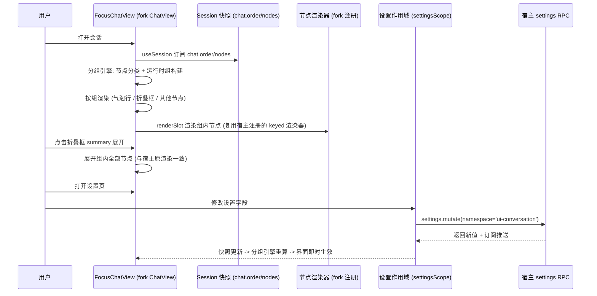
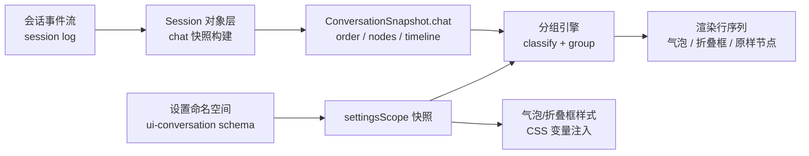

# UI 设计 - dsh-chat-focus - 总规划

## 文档信息

| 项目 | 内容 |
|------|------|
| 文档版本 | v1.0.0 |
| 创建日期 | 2026-08-16 15:34:03 |
| 设计类型 | UI 设计（含交互设计轨道，类型混用分阶段进行） |
| 状态 | 草稿 |
| 项目仓库 | E:\dsh-chat-focus（独立 git 仓库） |

---

## 1. 设计背景

### 1.1 项目背景

DeepSeek Harness Web GUI（dsh web）的对话界面中，模型在产出正式文本回复前会产生大量**运行时信息**（read/glob/grep 等工具调用、think/深度思考、重试、上下文注入等）。这些信息逐条展开渲染，挤压正式回复的视觉地位，长对话中用户需要滚动大量运行时卡片才能读到文本回复。

本项目创建一个独立分发的客户端插件 **dsh-chat-focus**，目标：
1. 将每条文本回复之前的**连续运行时信息**收纳进一个可展开的折叠框，界面以正式回复为视觉重心（用户选定的「保留最近 N 条」策略下，回复前最近 N 条运行时信息仍留在框外可见——这是刻意的例外，见 L0 决策 4）；
2. 文本回复以**聊天气泡**形式呈现，用户/助手气泡区分角色；
3. 设置面板可配置：插件总开关、气泡开关、保留可见条数 N、折叠框默认状态、摘要显示方式、折叠策略模式、气泡样式、思考内容独立折叠；
4. **独立仓库分发，不对宿主源码做修改**（宿主源码零改动；以 bundle 补丁层禁用宿主 ui-conversation 行并挂载 fork，补丁层可叠加可移除）；实现形式为**复制原对话模块（ui-conversation）+ 改造**（fork 替换增强版）。

### 1.2 用户分析

- 目标用户：dsh web 的日常使用者（开发者/研究人员），高频阅读对话流；
- 用户偏好：信息密度可控、正式回复优先、细节按需展开；
- 使用场景：多轮 agent 会话（工具密集型）、回溯历史对话、向他人展示对话截图；
- 痛点：运行时卡片与文本回复同等权重堆叠，长会话阅读效率低、重点模糊。

### 1.3 平台要求

- 主要平台：Web（dsh web GUI，宿主为 deepseek-harness 部署）；
- 渲染环境：浏览器客户端 cordis 插件（dsh.client 行，platform: web）；
- 数据源：会话快照 `ConversationSnapshot.chat`（order/nodes/timeline），与宿主渲染完全同源；
- 宿主版本基线：deepseek-harness `apps/web` + `packages/client/ui-conversation`（rc.5 基线，fork 需固定基线版本并在 README 记录上游适配流程）。

### 1.4 品牌约束

- 视觉基底沿用宿主 `ui-theme` 的 `--dsw-*` 语义 token（无字面色值、无组件库、无 Tailwind，遵守 `docs/web-styling.md`）；
- 产品文案中文，代码注释英文；
- 无障碍：WCAG 2.1 AA（语义化 HTML、ARIA、键盘导航、对比度）。

---

## 2. L0 决策记录表

| 序号 | 时间戳 | 决策点 | 方案A | 方案B | 方案C | 用户选择 | 选择理由 |
|------|--------|--------|-------|-------|-------|----------|----------|
| 1 | 15:35 | 设计类型 | 方案设计 | 系统设计 | UI+交互设计 | UI+交互设计 | 用户确认聚焦界面视觉与操作流程 |
| 2 | 15:35 | 仓库位置 | E:\dsh-chat-focus | C:\Users\super\dsh-chat-focus | 其他 | E:\dsh-chat-focus | 与宿主平级独立 git 仓库 |
| 3 | 15:35 | 实现架构 | 视图附加型（add-on view） | fork 替换型 | fork 替换增强版 | fork 替换增强版 | 用户要求复制原对话模块+改造；改造后界面即默认对话界面；在 B 基础上增加主题化气泡、折叠策略多模式、运行时摘要聚合 |
| 4 | 15:35 | 折叠策略 | 阈值折叠（>N 才折叠） | 保留最近 N 条可见 | 全部折叠 | 保留最近 N 条 | 始终折叠运行时信息，回复前最近 N 条留在框外可见，更早的收进框内 |
| 5 | 15:35 | 气泡风格 | 最小气泡 | 标准聊天气泡 | 主题化气泡 | 主题化气泡 | 可配置颜色/圆角/宽度，与折叠框视觉统一 |
| 6 | 15:35 | 设置项 | 精简（三项） | 标准（五-六项） | 完整（八项+） | 完整 | 插件总开关、气泡开关、保留可见条数 N、折叠框默认状态、摘要显示、折叠策略模式、气泡样式、思考独立折叠 |
| 24 | 18:40 | 方案定案 | fork 替换型（主方案） | 视图附加型（备选） | — | fork 替换型（主）+ 视图附加型（备选文档） | 用户确认 fork 版为主方案；视图附加版（含排第一/引导条/更新鲁棒性分析）作为备选方案单独成文，见「备选方案-视图附加型」文档 |

---

## 3. 视觉理念（UI-L0）

### 3.1 设计理念

**「回复优先，细节按需」**：对话流的视觉重心始终是正式文本回复（气泡），运行时信息以低打扰的折叠带存在，展开后信息完整可查、层级清晰。视觉语言与宿主主题 token 完全一致，插件只做布局与容器层改造，不引入新的色彩体系。

### 3.2 风格定位

- 风格关键词：克制、清晰、可配置；
- 视觉调性：与宿主既有对话界面同源（同一套 `--dsw-*` token），气泡与折叠框是宿主卡片视觉的延续而非异类；
- 参考风格：主流聊天应用（气泡左右分列）+ 宿主 Trajectory 视图的紧凑信息密度。

### 3.3 主题化（L0 决策 5 衍生）

- 气泡：颜色（助手/用户可分别配置，默认取宿主主题语义色）、圆角、最大宽度；
- 折叠框：背景、边框、摘要行样式；
- 所有可配置项以 CSS 变量注入，通过设置命名空间持久化；不写死任何色值。

---

## 4. 交互理念（IA-L0）

### 4.1 设计理念

**「一条路径，两级深度」**：读对话（浏览正式回复）与查细节（展开运行时信息）是同一滚动路径上的两级深度，展开/收起即时、无跳转、无模态。

### 4.2 设计原则

1. **零干扰默认**：插件开启后默认不改变信息完整性——所有被折叠的内容一键可展开，展开后与宿主原渲染完全一致（复用宿主节点渲染器）；
2. **即时反馈**：折叠框展开/收起、设置变更均即时生效，无加载、无跳转；
3. **可撤销/可恢复**：所有折叠均可在框内展开；插件总开关关闭后界面回到宿主原生表现；
4. **键盘可达**：折叠框 summary 可聚焦、可回车展开（原生 `<details>` 语义）。

### 4.3 用户体验目标

- 效率：正式回复可见性提升——运行时信息不再抢占首屏与滚动焦点；
- 易学：折叠框即"可展开的摘要条"，无需学习；
- 满意度：视觉重心符合"我在和 agent 对话"的心智模型；
- 容错：设置保存失败、命名空间不可用等场景有明确降级（回到宿主表现）。

---

## 5. 系统组合运行视图（强制前置）

### 5.1 运行时协作图（一次完整用户操作的跨模块调用链）



### 5.2 数据流转图



- 段契约：`chat.nodes.get(key)` 的 `ChatConversationViewNode`（kind/data/location）只读消费；分组引擎输出纯数据（组列表），不修改快照；设置读取走 `settingsScope.bind` 的 SnapshotStore，不阻塞插件激活。

### 5.3 模块职责与消费关系矩阵（预想 L1 划分）

| 模块 | 职责 | 产出 | 消费者 |
|------|------|------|--------|
| M1 fork 基底（复制 ui-conversation） | 槽位契约、骨架、composer、输入机器、服务 | 与宿主一致的注册面 | 宿主全部既有插件（ui-tool/ui-plan/ui-commands…） |
| M2 分组引擎 | 节点分类、运行时组构建、组摘要 | 组列表纯数据 | M4 FocusChatView、M3 折叠框组件 |
| M3 气泡与折叠框组件 | 气泡容器、折叠框 UI、主题化样式 | 渲染行 | M4 FocusChatView、M5 设置页预览 |
| M4 改造后的 ChatView | 组级渲染、滚动/分页/锚点（宿主逻辑保持） | 对话视图 | 用户 |
| M5 设置域 | 命名空间 schema 扩展、设置页、实时预览 | 设置快照 + 页面 | M2/M3 消费快照；用户操作页面 |

### 5.4 基础设施骨架（UI/交互强制）

- **槽位契约清单（fork 必须逐项保持与宿主一致，否则宿主插件注册失败）**：

| 槽位 | kind/scope | 声明者（宿主） | fork 处理 |
|------|-----------|--------------|----------|
| conversation | single/session-maybe | ui-conversation | 原样复制 |
| conversation.session | single/session | 同上 | 原样复制 |
| conversation.session.header | single/session | 同上 | 原样复制 |
| conversation.composer / .bar / input.* / hero.* / composer.dock / input.dock / session.header.* | 见宿主 apply.ts | 同上 | 原样复制 |
| conversation.view | list/session | 同上（id chat） | 原样复制（id 仍为 chat） |
| conversation.chat.node | keyed/session | 同上（inject turnData） | **原样复制声明**（ui-tool 等宿主插件继续注册进入） |
| conversation.chat.turnTail / assistant-actions / commandview | 见宿主 | 同上 | 原样复制 |
| details / conversation.details.tool | 见宿主 | 同上 | 原样复制 |

- **设置命名空间 schema（扩展宿主 'ui-conversation' 命名空间，宿主 api-proxy 白名单已放行，不新增命名空间）**：

```typescript
// 示意（z 为 @deepseek-ai/schemastery 导出，宿主同款；定稿见 M5 §2）
const ChatFocusSchema = z.object({
  enabled: z.boolean().default(true),           // 插件总开关
  bubbles: z.boolean().default(true),           // 气泡开关
  foldKeepVisible: z.number().default(1),       // 折叠策略: 回复前保留可见的运行时条数 N（keep-recent 语义）
  foldDefaultOpen: z.boolean().default(false),  // 折叠框默认状态
  foldSummary: z.boolean().default(true),       // 折叠框摘要显示
  foldStrategy: z.union(['keep-recent', 'threshold', 'always']).default('keep-recent'), // 折叠策略模式
  bubbleStyle: z.union(['default', 'compact']).default('default'),                      // 气泡样式
  foldReasoning: z.boolean().default(true),     // 思考内容独立折叠
})
```

- **页面流转图（设置页导航）**：设置面板（settings.trigger）→ 设置 section「对话显示」（settings.section id=chat-focus）→ 8 个设置控件；控件变更 → settingsScope.set → 宿主持久化 → 订阅推送回 FocusChatView 即时生效。

- **全局错误/降级状态**：命名空间不可用（unavailable）→ 插件按默认值运行；设置写失败 → 保留当前值并静默降级（宿主 SettingsScopeController 已有语义）；折叠框内节点渲染失败 → 沿用宿主 JsonBlock fallback。

---

## 6. 设计总览

### 6.1 L1 决策记录（单包域划分）

| 序号 | 时间戳 | 决策点 | 方案A | 方案B | 方案C | 用户选择 | 选择理由 |
|------|--------|--------|-------|-------|-------|----------|----------|
| 7 | 15:53 | L1 模块划分 | 最小覆盖包 | 单包域划分 | 双包分离 | 单包域划分 | 与宿主 ui-conversation 先例一致，域间无零乱依赖，避免槽位声明冲突 |
| 8 | 15:53 | 设置页信息架构 | 平铺列表 | 三组分区 | 分组+实时预览 | 分组+实时预览 | 折叠面板分组 + 外观组实时预览，可读性最好 |

### 6.2 模块文档索引（单包域划分）

| 模块 | 域目录 | 文档 | 状态 |
|------|--------|------|------|
| M1 基底复制域 | contract/ + base/（skeleton/composer/input/queue/service） | ui-design-20260816-dsh-chat-focus-模块1-基底复制域.md | 已建/草稿 |
| M2 分组引擎 | chat/grouping/ | ui-design-20260816-dsh-chat-focus-模块2-分组引擎.md | 已建/草稿 |
| M3 气泡与折叠框组件 | chat/bubbles/ | ui-design-20260816-dsh-chat-focus-模块3-气泡与折叠框.md | 已建/草稿 |
| M4 改造后的 ChatView | chat/ | ui-design-20260816-dsh-chat-focus-模块4-改造ChatView.md | 已建/草稿 |
| M5 设置域 | settings/ | ui-design-20260816-dsh-chat-focus-模块5-设置域.md | 已建/草稿 |
| 交互轨道 | — | interaction-design-20260816-dsh-chat-focus-任务流程.md | 已建/草稿 |
| 备选方案 | — | solution-design-20260816-dsh-chat-focus-备选方案-视图附加型.md | 已建/草稿（决策 24 定案保留） |

---

## 7. 设计状态

- L0 决策：完成（7 项：1-6 + 24 定案）
- L1 决策：完成（模块划分、设置页信息架构、M2-M5 各决策点）
- L2 决策：完成（展开持久化、思考语义、气泡时间、展开动画时长、摘要行点击热区）
- 验证：三轮独立验证通过（第一轮 22 项问题全部修正；第二轮 19/20 + 8 项全部修正；第三轮定案与备选文档 8 项 minor 全部修正，关键机制与宿主源码 8/8 核实一致）
- 文档集：总规划 + M1-M5 模块文档 + 交互任务流程文档 + 备选方案文档
- 下一步：实施（复制宿主 ui-conversation → 改造 chat 域 → tsdown 打包 → bundle 补丁 → 测试）
