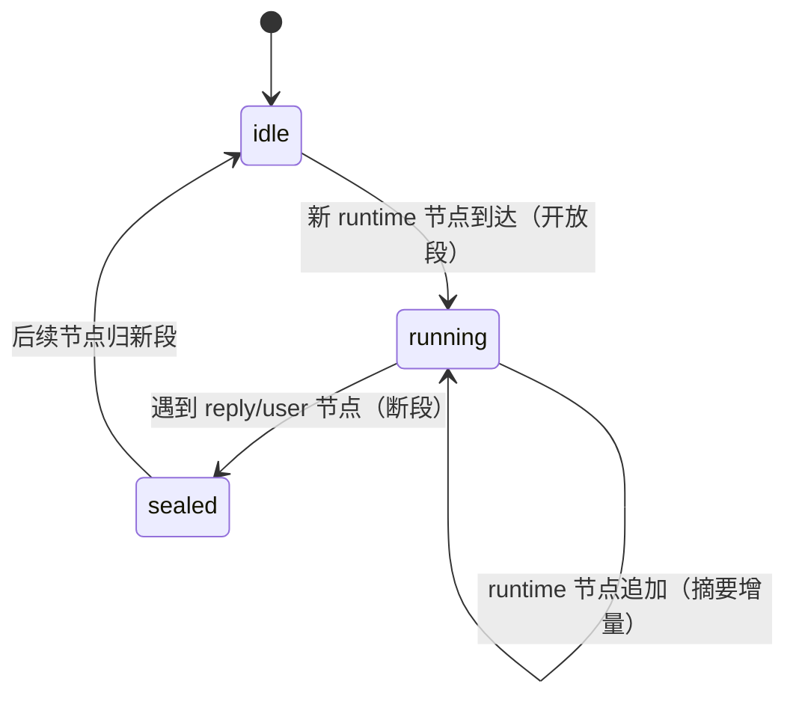

# UI 设计 - dsh-chat-focus - 模块2：分组引擎

## 文档信息

| 项目 | 内容 |
|------|------|
| 模块ID | M2 |
| 创建日期 | 2026-08-16 15:56 |
| 模块类型 | 逻辑引擎（chat/grouping/，纯函数 + 流式增量） |
| 状态 | 草稿 |

---

## 1. 模块概述

### 1.1 在系统组合中的位置

分组引擎消费 `ConversationSnapshot.chat`（order/nodes）与设置快照（M5），产出**组行序列**（纯数据），M4 改造后的 ChatView 按组渲染，M3 组件消费组内节点与摘要。引擎是渲染与数据之间的唯一转换层：任何节点分类/边界规则变化只改引擎，不碰渲染。

### 1.2 决策记录（L1）

| 序号 | 时间戳 | 决策点 | 方案A | 方案B | 方案C | 用户选择 | 选择理由 |
|------|--------|--------|-------|-------|-------|----------|----------|
| 11 | 15:56 | 节点分类规则 | 仅按 kind | kind+内容双判 | 双判+运行态特判 | kind+内容双判 | 纯思考步骤（无 text）算运行时信息，折叠彻底；不引入运行态特判，流式阶段行为由 M4 处理 |
| 12 | 15:56 | 组边界规则 | 提问间分组 | 连续段+尾部保留 | 回合分组 | 连续段+尾部保留 | 组=回复前的连续运行时段，段内最后 N 条留在框外，符合 L0「保留最近 N 条」 |

### 1.3 消费者清单（原则3）

| 消费者 | 消费方式 |
|--------|---------|
| M4 改造后的 ChatView | 主消费：按组渲染、锚点键、流式重组 |
| M3 折叠框组件 | 组摘要（工具名列表、分类计数）、组内节点键 |
| M3 气泡组件 | 气泡组的数据源（assistant/user 节点键） |

---

## 2. 节点分类规则（L1 决策 11 落地）

输入：`ChatConversationViewNode`（kind + data）+ 设置（foldReasoning）；输出：`NodeClass = 'reply' | 'user' | 'runtime' | 'tail' | 'other'`。

| kind | 分类条件 | 类别 |
|------|---------|------|
| user / steering | 无条件 | user |
| assistant-step | data.blocks 含 ≥1 个 `{kind:'text'}` 块 | reply（不受 foldReasoning 影响） |
| assistant-step | 无 text 块；含 ≥1 个 reasoning 块 | runtime（foldReasoning=false 时不纳入运行时组，见下方注） |
| assistant-step | 无 text/reasoning 块（纯 image/tool-call/other） | runtime |
| tool-call | 无条件 | runtime |
| context | 无条件 | runtime |
| model-retry / turn-error / turn-max-tokens | 无条件 | runtime |
| command / manual-compaction / compaction | 无条件 | runtime |
| unknown | 无条件 | runtime |
| turn-tail | 无条件 | tail（跟随其 closing reply 行，不折叠） |

> foldReasoning 落地：`foldReasoning=false` 时，上表「无 text 块且含 reasoning」一类**不进入 runtime-run 组**，按独立行渲染（行归属 'other'，M4 按宿主样式渲染，不参与任何折叠）；`foldReasoning=true`（默认）时正常入组。该条件在 `buildGroups` 的 settings 参数中显式读取（§5）。

分类规则以表格 + 纯函数单测锁定；未知 kind 落入 runtime 并在摘要计数中归类「其他」。

## 3. 组边界规则（L1 决策 12 落地）

### 3.1 分段

按 `order` 顺序扫描，构建组序列：

```
组类型 = 'user' | 'reply' | 'runtime-run' | 'tail' | 'other'
扫描规则：
- user 节点 → 独立 user 组（气泡行）
- reply 节点 → 独立 reply 组（气泡行）；其后的 tail 节点并入该 reply 组
- runtime 节点 → 追加到"当前运行时段"；遇到 reply/user 节点时运行时段结束（断段）
- foldReasoning=false 时，无 text 含 reasoning 节点 → 独立 'other' 行（不并入运行时段）
- 连续 runtime 节点构成一个 runtime-run 组
```

### 3.2 尾部保留（foldKeepVisible = N）

- runtime-run 组内：最后 N 条节点标记 `visibleOutside`（留在折叠框外），更早的进折叠框；
- N = 0：全部收进折叠框；N ≥ 组长度：全部留在框外（等效不折叠，此时折叠框不渲染，直接按宿主样式渲染）；
- 设置 `enabled=false` 时引擎直接透传宿主原序（分组关闭）。

### 3.3 流式更新

- 新节点追加到当前开放段（`running` 组可增长）；组摘要（计数/工具名）随之增量更新；
- 已断段的组不可变（快照引用稳定——React.memo 前提）。

## 4. 组摘要生成（L1 决策 13 落地）

输入：runtime-run 组内节点；输出摘要字段：

| 字段 | 规则 |
|------|------|
| total | 组内节点总数（含框外保留条） |
| toolCount / thinkCount / otherCount | 分类计数：tool-call 节点数；含 reasoning 块的 assistant-step 数；其余 |
| toolNames | 组内 tool-call 的工具名**去重**、按首次出现顺序，最多显示 K 个（K=5 固定，不开放配置），超出显示「等 N 个」 |
| hiddenCount / visibleCount | 进框条数 / 框外保留条数 |

摘要为纯函数（确定性、可快照测试）。

## 5. 接口契约

```typescript
// chat/grouping/contract.ts
type NodeClass = 'reply' | 'user' | 'runtime' | 'tail' | 'other'
interface RuntimeSummary { total: number; toolCount: number; thinkCount: number; otherCount: number; toolNames: string[] }
interface GroupRow =
  | { kind: 'user' | 'reply' | 'other'; nodeKey: string }
  | { kind: 'tail'; nodeKey: string }          // 并入 reply 组渲染
  | { kind: 'runtime-run'; inside: string[]; outside: string[]; summary: RuntimeSummary; anchorKey: string }

function buildGroups(order: readonly string[], nodes: Map<string, ChatNode>, settings: FocusSettings): GroupRow[]
function updateSummary(prev: RuntimeSummary, node: ChatNode): RuntimeSummary   // 增量
```

失败场景：order 中某键在 nodes 中缺失（分页窗口外）→ 该键跳过并记录（宿主同样容忍）；settings 未就绪 → 使用默认值构建。

## 6. 状态机（流式场景）



## 7. 行业标准合规（原则6）

- 纯函数 + 确定性：可快照测试（与宿主 snapshot 测试分层一致）；
- 无 IO、无 DOM、无宿主可变状态依赖；错误不吞（调用方可见）。

## 8. stub 清单（原则7）

| stub 位置 | 用途 | 消除里程碑 | 消除方案 |
|-----------|------|-----------|---------|
| 无 | — | — | — |

## 9. L2 划分（待细化决策）

- L2-1 分类器（classify.ts）：kind+内容双判纯函数
- L2-2 分段器（segment.ts）：order 扫描、断段、尾部保留
- L2-3 摘要生成器（summary.ts）：计数 + 工具名列表（含增量更新）
