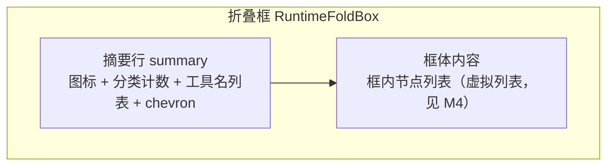
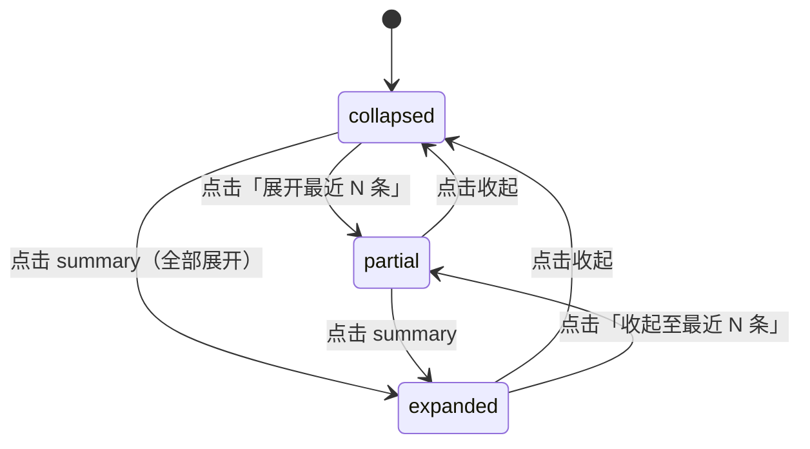

# UI 设计 - dsh-chat-focus - 模块3：气泡与折叠框组件

## 文档信息

| 项目 | 内容 |
|------|------|
| 模块ID | M3 |
| 创建日期 | 2026-08-16 15:56 |
| 模块类型 | 展示组件域（chat/bubbles/） |
| 状态 | 草稿 |

---

## 1. 模块概述

### 1.1 在系统组合中的位置

本模块提供两族渲染组件，由 M4 改造后的 ChatView 按组行类型挂载：
- **折叠框（RuntimeFoldBox）**：渲染 runtime-run 组的摘要行与框内节点；
- **气泡（ChatBubble）**：渲染 user/reply 组的聊天气泡（角色分列 + 主题化）。

组件只读消费 M2 的组数据与节点快照、M5 的设置快照；展开/收起状态为本组件私有状态（localStorage 持久化，见 L2 决策 17）。

### 1.2 决策记录（L1）

| 序号 | 时间戳 | 决策点 | 方案A | 方案B | 方案C | 用户选择 | 选择理由 |
|------|--------|--------|-------|-------|-------|----------|----------|
| 13 | 15:56 | 折叠框摘要与展开 | 纯计数摘要 | 分类计数摘要 | 工具名列表摘要+部分展开 | 工具名列表摘要 | 摘要行显示去重工具名列表（read、glob…），支持「展开框内最近 N 条」部分展开，信息密度最高 |
| 14 | 15:56 | 气泡结构 | 仅助手气泡 | 双气泡固定样式 | 双气泡+主题化 | 双气泡+主题化 | 用户/助手左右分列、角色图标+时间、CSS 变量可配置颜色/圆角/宽度、连续多段文本合并一泡、与折叠框共用圆角体系 |

### 1.3 消费者清单（原则3）

| 消费者 | 消费方式 |
|--------|---------|
| M4 改造后的 ChatView | 挂载两族组件 |
| M5 设置页预览 | 复用组件渲染真实节点（frozen 数据） |

---

## 2. 折叠框组件设计（RuntimeFoldBox）

### 2.1 结构

- 使用原生 `
/
` 语义（键盘可达、无自定义焦点管理）；
- 摘要行文案（默认态）：「12 条活动 · 工具 8 · 思考 3 · 其他 1 · read、glob、grep 等 5 个」，行首为宿主图标族图标（与消息行图标同源，不引入 emoji）；
- 工具名列表超出 K 个（K=5，固定值，不开放配置）显示「等 N 个」；`foldSummary=false` 时只显示计数；
- 展开行为三态：收起（默认，`foldDefaultOpen=false`）、全部展开、**部分展开（展开最近 N 条，N=foldKeepVisible 同值）**；
- 摘要行内「展开框内最近 N 条」按钮：点击需 `preventDefault` + `stopPropagation`（阻止冒泡触发 details 原生 toggle）；键盘用户经 Tab 聚焦按钮后回车触发，等效于摘要行的部分展开语义；
- 展开/收起动画：≤200ms 淡入 + 高度过渡（决策 20），长列表展开不卡顿；动画仅作用于框体内容，不作用于框外保留条；
- 展开状态持久化：localStorage（键 `dsh.chat-focus.fold.<组anchorKey>`），跨会话保留；流式追加不重置用户展开状态（L2 决策 17）。

### 2.2 框外保留条（outside 节点）

- 折叠框上方/下方渲染框外保留条（保留最近 N 条），样式沿用宿主节点行（无气泡）；
- 它们不属于折叠框，渲染为独立行——视觉上位于折叠框与回复气泡之间，成为"最近活动"的自然过渡；
- 折叠框收起时框外保留条**始终可见**（这是「保留最近 N 条」策略的可见性承诺，不随折叠框状态变化）。

### 2.3 思考内容折叠语义（L2 决策 18 落地）

- **沿用宿主行为**：折叠框展开后，组内 reasoning 节点按宿主 ReasoningRow 原样渲染（宿主本身已是可收起样式），不额外做两层折叠；
- `foldReasoning=true`（默认）：含 reasoning 且无 text 块的 assistant-step 纳入运行时组；
- `foldReasoning=false`：上述节点**不纳入运行时组**，按宿主样式独立渲染在组外（作为"思考"保留可见）；
- 含 text 块的 assistant-step 恒为 reply（不受 foldReasoning 影响，与 M2 分类规则一致）。

### 2.4 状态机

- 「收起至最近 N 条」：展开态下摘要行内按钮，将视图回收到部分展开态（保留最近 N 条可见），视觉上折叠框收回、框外保留条维持原状；
- 不变量：partial 态的 visible 集合 = outside（框外保留条）+ 框内最近 N 条；expanded 态 = 全部节点可见。

### 2.5 失败场景

| 场景 | 处理 |
|------|------|
| 组内节点渲染抛错 | 单节点降级为 JsonBlock fallback（宿主同款），折叠框整体不崩 |
| localStorage 不可用（隐私模式） | 展开状态仅存本次渲染内存，功能不受影响 |
| localStorage 容量受限（配额写满） | 写入 catch 后静默回退为会话内内存状态，不提示、不重试 |
| 流式更新中用户正在展开 | 追加节点进入当前展开视图，不重置滚动与状态 |

### 2.6 bubbles 开关渲染回退（设置字段契约落地）

| bubbles 值 | user 节点 | reply 节点 | 折叠框/运行时组 |
|-----------|----------|-----------|----------------|
| true（默认） | 用户气泡 | 助手气泡 | 折叠框按设置渲染 |
| false | 宿主原样式行（右对齐、无气泡容器） | 宿主 AssistantMarkdown 原行（无气泡容器） | 折叠框不受影响（运行时折叠独立于气泡开关） |

即 `bubbles` 只控制气泡容器层，不影响折叠行为；折叠框始终按 enabled/foldStrategy 生效。

---

## 3. 气泡组件设计（ChatBubble）

### 3.1 结构

- **user 气泡**：右侧对齐，宿主现有用户消息行改造（气泡容器 + 时钟 + 复制操作沿用宿主 MessageIconActions）；
- **assistant 气泡**：左侧对齐，内容为宿主 AssistantMarkdown 渲染（文本/reasoning/图片块保持），外层包气泡容器；
- 角色标识：圆形图标位（助手=模型图标，用户=人形图标），图标来自宿主图标族（无头像资源；若宿主无模型图标，见 §5 stub）；
- 时间：HH:MM 相对时间，跨天显示日期（L2 决策 19；与宿主会话列表时间格式一致）；
- 连续多段文本：reply 组内同一 turn 的多个 assistant-step 含文本块时**合并为一个气泡**（分块渲染，保留 markdown 分隔），turn-tail 脚注渲染在气泡下方。

### 3.2 主题化（L1 决策 14 落地）

CSS 变量（默认值映射宿主 `--dsw-*` 语义 token，无字面色值；由 M5 设置写入）：

| 变量 | 默认映射 | 说明 |
|------|---------|------|
| `--chat-focus-bubble-assistant-bg` | 宿主表面/背景 token | 助手气泡底色 |
| `--chat-focus-bubble-user-bg` | 宿主强调色 token 经 `color-mix(in oklab, 该token 12%, transparent)` 降透明度 | 用户气泡底色 |
| `--chat-focus-bubble-radius` | 宿主圆角 token（lg） | 气泡圆角 |
| `--chat-focus-bubble-max-width` | 720px | 气泡最大宽度 |
| `--chat-focus-fold-bg` | 宿主表面 token | 折叠框背景 |
| `--chat-focus-fold-border` | 宿主边框 token | 折叠框边框 |
| `--chat-focus-fold-radius` | 宿主圆角 token（md） | 折叠框圆角（与气泡同体系） |

- `bubbleStyle='compact'`：缩小圆角/内边距/最大宽度，信息密度优先；
- 深色模式：全部经宿主 token，自动跟随（不写死颜色）；
- token 名以宿主 ui-theme 实际导出的语义 token 为准（实施时核对 `ui-theme/src/styles/` 清单）。

### 3.3 无障碍（原则6）

- 对话流容器声明 `role="list"`，气泡行 `role="listitem"`（由 M4 的组行渲染容器提供，配对成立）；
- 折叠框 `details/summary` 原生键盘可达；摘要行 chevron 用 aria-hidden；
- 摘要行内按钮（展开框内最近 N 条/收起至最近 N 条）可独立聚焦，按钮 label 描述其效果；
- 对比度依赖宿主 token 校验（WCAG 2.1 AA）。

---

## 4. 行业标准合规（原则6）

- 无组件库、无 Tailwind、无字面色值（宿主 web-styling 规则）；
- 中文文案、英文注释（宿主规则）；
- CSS Modules + clsx（宿主规则）。

## 5. stub 清单（原则7）

| stub 位置 | 用途 | 消除里程碑 | 消除方案 |
|-----------|------|-----------|---------|
| 角色图标 | 首版用宿主现有图标（IconChevron 族） | v0.1 发布前 | 若宿主无合适模型/人形图标，绘制内联 SVG 图标组件并注册进主题变量 |

## 6. L2 决策记录

| 序号 | 时间戳 | 决策点 | 方案A | 方案B | 方案C | 用户选择 | 选择理由 |
|------|--------|--------|-------|-------|-------|----------|----------|
| 17 | 16:03 | 展开状态持久化 | 仅会话内 | localStorage 按组持久化 | 不持久化 | localStorage 按组持久化 | 跨会话保留用户展开习惯，容量受限静默回退 |
| 18 | 16:03 | 思考内容折叠语义 | 沿用宿主行为 | 两层折叠 | 完全隐藏 | 沿用宿主行为 | 宿主 ReasoningRow 本就可收起，不重复折叠；foldReasoning 仅控制是否纳入运行时组 |
| 19 | 16:03 | 气泡时间显示 | 不显示时间 | HH:MM+跨天日期 | 完整时间戳+时长 | HH:MM+跨天日期 | 简洁且保留时间锚点，与宿主格式一致 |

## 7. L2 划分（已定）

- L2-1 RuntimeFoldBox（摘要行、三态展开、localStorage 持久化）
- L2-2 ChatBubble（user/assistant 变体、多段合并、HH:MM 时间/操作行）
- L2-3 主题变量（变量表、compact 变体、与宿主 token 映射）
