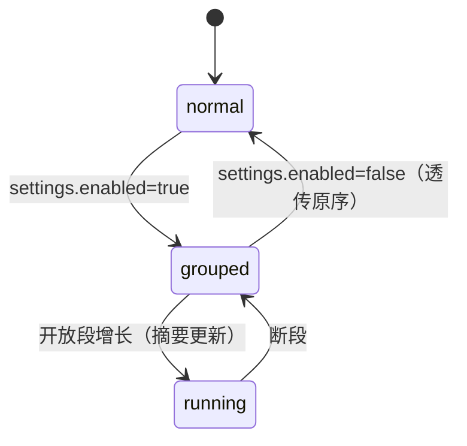

# UI 设计 - dsh-chat-focus - 模块4：改造后的 ChatView

## 文档信息

| 项目 | 内容 |
|------|------|
| 模块ID | M4 |
| 创建日期 | 2026-08-16 15:57 |
| 模块类型 | 视图改造（chat/ChatView.tsx + ChatNodeSeat 组级化） |
| 状态 | 草稿 |

---

## 1. 模块概述

### 1.1 在系统组合中的位置

M4 是宿主 ChatView 的改造副本：保持宿主全部滚动/分页/锚点/底部跟随/加载更早逻辑，只把 `order.map` 的逐节点渲染替换为 **M2 组行序列渲染**。它是 M2 的主消费者、M3 的挂载点，也是与宿主差异最大的改造面。

### 1.2 决策记录（L1）

| 序号 | 时间戳 | 决策点 | 方案A | 方案B | 方案C | 用户选择 | 选择理由 |
|------|--------|--------|-------|-------|-------|----------|----------|
| 15 | 15:57 | 改造面 | 最小侵入 | A+组缓存 | B+虚拟滚动 | B+虚拟滚动 | 用户选择完整方案：组缓存 + 折叠框内虚拟列表；虚拟化仅限折叠框内容，外层对话流保持宿主滚动机制 |

### 1.3 消费者清单（原则3）

| 消费者 | 消费方式 |
|--------|---------|
| 用户 | 直接消费（对话视图） |
| 宿主 ui-tool 等 | 经 `conversation.chat.node` 键控渲染器被组内节点复用（渲染器不变） |

---

## 2. 改造面

### 2.0 改造文件清单（承接 M1 §2.2 引用）

| 文件 | 改造内容 |
|------|---------|
| src/client/chat/ChatView.tsx | order.map → groups.map（组级渲染）；其余逻辑保持 |
| src/client/chat/ChatNodeSeat.tsx | 不变（组内节点仍经 keyed 渲染器分发） |
| src/client/chat/MessageItem.tsx | 用户行加气泡容器（bubbles 开关回退见 M3 §2.6）；其余保持 |
| src/client/chat/AssistantMarkdown.tsx | 助手文本外包气泡容器（M3 消费） |
| src/client/chat/grouping/*（新增） | M2 分组引擎挂载点 |
| src/client/chat/bubbles/*（新增） | M3 组件 |
| src/client/chat/ChatView.module.css | 组行/折叠框/气泡样式（token 映射见 M3 §3.2） |

### 2.1 组级渲染

- `order.map(ChatNodeSeat)` → `groups.map(RenderGroupRow)`；
- RenderGroupRow 按组类型分发：user/reply → M3 气泡；runtime-run → 折叠框（+框外保留条独立行）；tail → 并入 reply 气泡下方；other → 宿主原样行；
- 组结构 memo：`useMemo(() => buildGroups(order, nodes, settings), [order, nodes, settings])`，节点增量更新不重建整树（快照引用稳定前提下）；
- 流式：开放段追加时仅摘要字段变化，折叠框内部增量追加（不重挂载）。

### 2.2 锚点与滚动兼容（强制）

- `data-chat-anchor-key`：组行取组内**首节点键**（runtime-run 取 inside[0]，reply 取节点键），保持宿主 pagingAnchor/elementsFromPoint 语义；
- `data-chat-flow-key/kind`：kind 用组类型（runtime-run），供将来排查；
- 底部跟随/ResizeObserver/滚动位置保存：完全沿用宿主（scrollPosition 锚定组行即可）；
- `loadOlder` 分页：prepend 后组序列整体重算，锚点行键不变则位置保持。

### 2.3 折叠框内虚拟列表（方案C 落地，风险受控）

- **范围**：仅展开的折叠框内容使用内部虚拟列表（固定行高估算 + 绝对定位 + 容器 `max-height` 内滚动）；
- **外层**：对话流滚动、锚点、elementsFromPoint 全部保持宿主实现，虚拟化不触碰外层；
- **降级**：组内节点 ≤ 阈值（50 条）时普通渲染；估算行高失败或渲染异常自动降级普通渲染（功能不受损）；
- 虚拟列表容器设置 `data-chat-fold-virtual`，与宿主 `[data-conversation-scroll]` 无冲突（内部滚动不注册外层滚动监听）；
- **无障碍**：虚拟列表容器 `role="region"` + `aria-label="运行时活动详情"`；屏外未渲染项不可聚焦属正常行为（滚动后自然可达），焦点不被虚拟化吞掉（无焦点劫持）；展开时焦点停留在 summary，不自动跳入列表。

### 2.4 失败场景

| 场景 | 处理 |
|------|------|
| 组数据与 nodes 不一致（分页窗口） | 缺失键跳过（M2 已定） |
| 虚拟列表渲染异常 | 捕获并降级普通渲染（不空白） |
| enabled=false | 组引擎透传原序 → 视图退化为宿主表现（气泡开关独立控制） |
| 极端长组（>1000 节点） | 虚拟列表保证渲染常数级节点数 |

---

## 3. 状态机（视图层）

## 4. 行业标准合规（原则6）

- 保持宿主性能纪律：渲染经济（memo、键稳定）、观察者不泄漏（ctx.effect/on 注册与释放跟随插件生命周期）；
- 虚拟列表实现遵循宿主"无手写滚动库"约束（自实现最小虚拟化，依赖仅 React）。

## 5. stub 清单（原则7）

| stub 位置 | 用途 | 消除里程碑 | 消除方案 |
|-----------|------|-----------|---------|
| 虚拟列表行高估算 | 固定行高假设（内容可变高的折叠框内节点） | v0.2（发布后首个迭代） | 行高缓存（ResizeObserver 测量首屏后校准） |
| ~~组缓存失效策略~~ | ~~首版全量重建~~ | 已消除 | 已由 §2.1 useMemo 键稳定 + M2 增量摘要覆盖，无需 stub |

## 6. L2 划分（待细化决策）

- L2-1 组行渲染器（RenderGroupRow + 分发）
- L2-2 虚拟列表（固定行高估算、降级阈值、滚动容器）
- L2-3 锚点/滚动适配（组行键、prepend 保位、位置保存）
