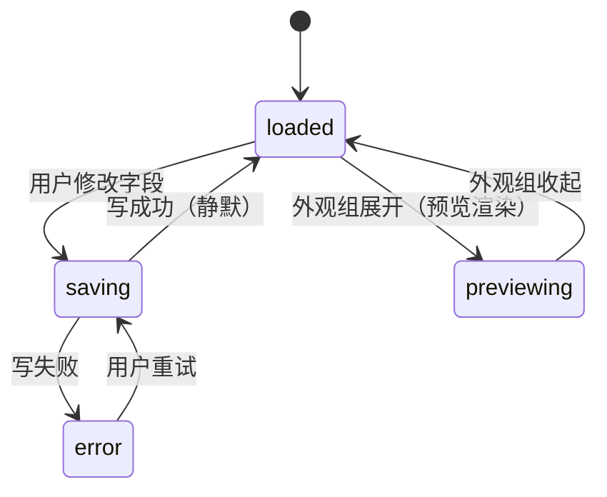

# UI 设计 - dsh-chat-focus - 模块5：设置域

## 文档信息

| 项目 | 内容 |
|------|------|
| 模块ID | M5 |
| 创建日期 | 2026-08-16 15:57 |
| 模块类型 | 设置域（settings/：schema + 设置页 + 预览） |
| 状态 | 草稿 |

---

## 1. 模块概述

### 1.1 在系统组合中的位置

M5 提供设置持久化与设置界面：node 半区注册扩展后的 `ui-conversation` 命名空间 schema（宿主 api-proxy 白名单已放行，**不新增命名空间**）；client 半区通过 `ctx.settingsScope.bind` 订阅快照，M2/M3 消费快照；注册 `settings.section`（id=chat-focus，『对话显示』页）供用户配置。

### 1.2 决策记录（L1）

| 序号 | 时间戳 | 决策点 | 方案A | 方案B | 方案C | 用户选择 | 选择理由 |
|------|--------|--------|-------|-------|-------|----------|----------|
| 8 | 15:53 | 设置页信息架构（引用 L1-02） | 平铺列表 | 三组分区 | 分组+实时预览 | 分组+实时预览 | 折叠面板分组 + 外观组实时预览，可读性最好 |
| 16 | 15:57 | 实时预览实现 | 静态示意图 | 复用真实组件 | 真实节点渲染 | 真实节点渲染 | 取当前会话最近运行时段快照 + 当前设置渲染，所见即所得 |

### 1.3 消费者清单（原则3）

| 消费者 | 消费方式 |
|--------|---------|
| M2 分组引擎 | 读设置快照（enabled/foldKeepVisible/foldStrategy/foldReasoning） |
| M3 气泡与折叠框 | 读设置快照（bubbles/foldDefaultOpen/foldSummary/bubbleStyle）+ 写入 CSS 变量 |
| 用户 | 设置页直接消费 |

---

## 2. 命名空间 schema（定稿）

扩展宿主 `ui-conversation` 命名空间（保留 `busyEnter` 字段，新增 8 字段）。`z` 为 `@deepseek-ai/schemastery` 的默认导出（宿主 ui-conversation 同款用法，语法与 zod 兼容；非 zod 依赖）：

```typescript
import z from '@deepseek-ai/schemastery'
const ChatFocusSchema = z.object({
  busyEnter: z.union(['queue', 'steer']).default('queue'),          // 宿主原有字段，保持
  enabled: z.boolean().default(true),           // 插件总开关（M2 透传原序）
  bubbles: z.boolean().default(true),           // 气泡开关（M3 §2.6 回退规则）
  foldKeepVisible: z.number().int().min(0).max(10).default(1),      // 保留可见运行时条数 N
  foldDefaultOpen: z.boolean().default(false),  // 折叠框默认展开
  foldSummary: z.boolean().default(true),       // 折叠框摘要（分类计数+工具名）
  foldStrategy: z.union(['keep-recent', 'threshold', 'always']).default('keep-recent'),
  bubbleStyle: z.union(['default', 'compact']).default('default'),  // 气泡样式
  foldReasoning: z.boolean().default(true),     // 思考步骤是否纳入运行时组（true=折叠；false=按宿主样式独立展示，见 M3 L2-18）
})
```

- 模式兼容：宿主旧值（仅 busyEnter）rehydrate 后新字段取默认值；
- 写路径：`settingsScope.set(field, value)`（宿主 revision 校验已有语义）；
- 不可用降级：namespace 不可用 → 全部字段按默认值运行（M2/M3 相同默认常量）。

## 3. 设置页（『对话显示』）

### 3.1 注册与结构

- `ctx.slots.register({ name: 'settings.section', id: 'chat-focus', order: 20, label: '对话显示' }, ChatFocusSection)`；
- 页面内三组**折叠面板**（details/summary，默认全部展开）：
  - 基本：插件总开关（enabled）、气泡开关（bubbles）；
  - 折叠：保留可见条数 N（foldKeepVisible，滑块/数字输入，含义=回复前留在折叠框外可见的运行时条数）、折叠框默认状态（foldDefaultOpen，切换）、折叠策略模式（foldStrategy，下拉：保留最近 N 条/阈值折叠/全部折叠）、思考内容独立折叠（foldReasoning，切换）；
  - 外观：气泡样式（bubbleStyle，下拉：标准/紧凑）、摘要显示（foldSummary，切换）+ **实时预览**；
- 控件用宿主 schema-form 组件（宿主 ui-settings 先例），字段即 schema 键；
- **未实现模式处理**：v0.1 仅实现 `foldStrategy='keep-recent'`；设置页下拉中 `threshold`/`always` 选项**禁用并标注「即将上线」**，禁用项不可选择（schema 仍接受该值以保证向后兼容，但 UI 不提供选择入口）；若历史值中出现未实现模式（旧数据），M2 按 keep-recent 降级运行；
- 每项变更即时 `settingsScope.set`，页面内显示保存状态（成功静默 / 失败保留原值）。

### 3.2 实时预览（L1 决策 16 落地）

- 数据源：当前会话 `chat.order/nodes` 中**最近一个已断段的 runtime-run 组**（+ 其前 reply 组）的节点快照（frozen 引用，不订阅流式）；
- 无可用会话/无组时显示内置样例节点（固定 tool-call/assistant-step 样例，标注"示例"）；
- 渲染：复用 M3 的 RuntimeFoldBox/ChatBubble 组件，传入 frozen 数据 + 当前设置快照；
- 设置变更 → 预览即时重渲（同一订阅源）；预览与主界面同组件实例代码路径（无重复实现）。

### 3.3 状态机（设置页）



### 3.4 失败场景

| 场景 | 处理 |
|------|------|
| namespace 不可用 | 设置页显示只读降级提示；M2/M3 按默认值运行 |
| 写失败（revision 冲突等） | 保留当前显示值，下轮订阅校正；不弹错阻塞 |
| 预览数据源会话关闭 | 预览降级为内置样例 |
| 宿主升级 schema 冲突 | README 适配流程（M1） |

---

## 4. 行业标准合规（原则6）

- schema 用 schemastery（宿主标准），校验在边界（settings RPC 与本地 rehydrate）；
- 设置页遵循宿主 settings 槽位契约（settings.section list/root）；
- 无障碍：控件均有 label、键盘可达（宿主 schema-form 自带）。

## 5. stub 清单（原则7）

| stub 位置 | 用途 | 消除里程碑 | 消除方案 |
|-----------|------|-----------|---------|
| 内置样例节点数据 | 无会话时预览占位 | v0.1 发布前 | 固定样例 JSON（标注"示例"），不接真实数据源 |
| foldStrategy 'threshold'/'always' 模式 | 首版仅实现 keep-recent，其余枚举保留 | v0.2 | 补两模式的分段器分支 + 测试 |

## 6. L2 决策记录

| 序号 | 时间戳 | 决策点 | 方案A | 方案B | 方案C | 用户选择 | 选择理由 |
|------|--------|--------|-------|-------|-------|----------|----------|
| 17-19 | 16:03 | 引用 M3 L2 决策（持久化/思考语义/时间） | — | — | — | 见模块3 | 跨模块一致 |

## 7. L2 划分（已定）

- L2-1 设置 schema 与作用域（扩展 + bind + 降级）
- L2-2 设置页组件（三组面板、控件、保存反馈）
- L2-3 实时预览组件（frozen 数据源、样例降级、复用 M3）
