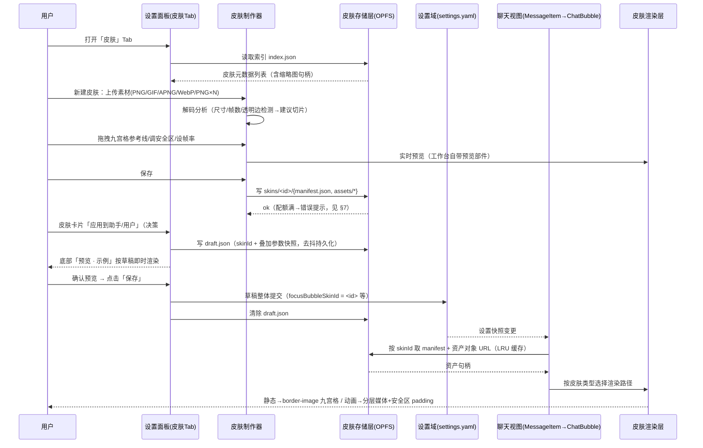
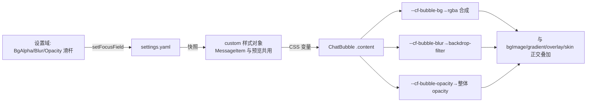
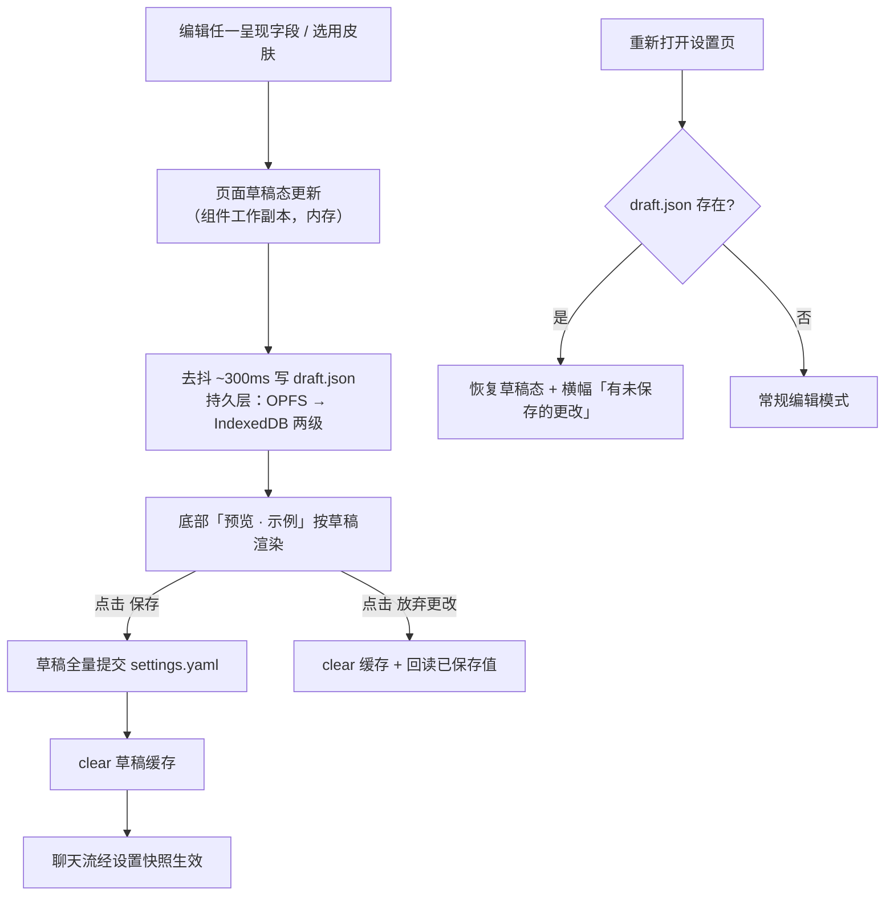

# UI 设计 - dsh-chat-focus 气泡皮肤与设置重组 - 总规划

## 文档信息

| 项目 | 内容 |
|------|------|
| 文档版本 | v1.3.0 |
| 创建日期 | 2026-08-17 21:38:24 |
| 修订记录 | v1.1.0（2026-08-22）：两段式应用模型（决策 #10，见 §3 / §4.1 / §4.5 / §5.4）；v1.2.0（2026-08-22）：基线更新至 v0.2.5（host 0.1.1-rc.2 统一双侧 ChatBubble 管线），刷新 §1.2 代码事实、改写 M2/M5 用户侧集成、M6 决策 6.3 标记已由上游完成、§9 回退为待实施；v1.3.0（2026-08-24）：设计审查修订（决策 #11–#14）——两段式并入 v0.4.0 合并发版、草稿降级层 localStorage→IndexedDB、编辑弹窗内嵌镜像预览、OPFS 不可用时预设下拉降级保留；另补 .dshskin 导入安全校验、border-image 语法与九宫格 padding 澄清、LRU 钉住与帧池共享、alpha 空值禁用、保存批量提交 |
| 设计类型 | UI 设计（含方案设计轨道：皮肤制作器技术路线） |
| 状态 | 进行中 |
| 项目仓库 | E:\dsh-chat-focus（v0.2.5 基线） |
| 上游文档 | ui-design-20260816-dsh-chat-focus-总规划.md（v0.1–0.2.4 设计） |

---

## 1. 设计背景

### 1.1 需求来源（用户原始描述，2026-08-17）

1. **半透明气泡支持**：气泡背景可调透明度（现状：`bg` 字段虽接受任意 CSS 颜色但无 alpha 控件，用户需手写 `rgba()`）。
2. **气泡皮肤制作器**：制作图片背景气泡；动态格式支持 GIF/视频，或 PNG 序列帧/APNG 路线；参考 QQ、微信的气泡制作（九宫格拉伸、气泡尾巴、内容安全区）。
3. **整理和优化设置选项**：设置页已膨胀（3 分组 + 两侧各 16 字段编辑器 + 6 模板 + 渐变 + 上传裁剪），新增皮肤功能后必须重组。

### 1.2 现状要点（v0.2.5 代码事实）

| 事实 | 位置 |
|------|------|
| 气泡渲染：CSS 变量注入 `--cf-bubble-*`，`.content` 单层背景（color + image + inset overlay）；**双侧统一组件**（`role` prop 仅区分头部/对齐） | `src/client/chat/bubbles/ChatBubble.tsx:107-140`、`ChatBubble.module.css:51-64` |
| 设置字段：每侧 16 个扁平字段（focusBubble\* / focusUserBubble\*），schemastery schema 持久化进宿主 settings.yaml | `src/submission-settings.ts:294`（ConversationSettingsSchema） |
| 背景图：data URI 直接存设置文件，上传压缩 ≤2MB + 长边 ≤1200px | `src/client/settings/ChatFocusSection.tsx:24`、`ImageCropper.tsx:18/171` |
| 设置 UI：单页三分组 + 两侧编辑器内联展开 + 底部固定实时预览（标题即「预览 · 示例」） | `src/client/settings/ChatFocusSection.tsx:697-776 / :811-842` |
| 预览与聊天双侧共用 ChatBubble 组件（v0.2.5 统一管线；旧 previewUserStyle 手写镜像已删除） | `ChatFocusSection.tsx:824-840`、`MessageItem.tsx:245` |

> **v0.2.5 基线说明**：本项目已适配 host 0.1.1-rc.2——双侧气泡统一为一条 ChatBubble 渲染管线（`userBubbleVars` / `--cf-user-bubble-*` / `previewUserStyle` 已从代码移除）。本文档 v1.2.0 据此改写 M2/M5 的用户侧集成描述；M6 决策 6.3 因此提前达成。

### 1.3 技术调研结论（2026-08-17，详见 §2）

1. **Chrome 下 `border-image` + 动图不可靠**：边缘平铺区不刷新、仅四角动画 → 九宫格拉伸与动画背景必须分两条渲染路径。
2. **格式质量**：APNG/动态 WebP 优于 GIF（真彩色+半透明+更小）；PNG 序列帧可控性最强但内存最高；视频流式解码最省内存但自动播放策略有兼容风险。
3. **OPFS**（Origin Private File System）：现代浏览器全支持，适合数十 MB 级皮肤资产；`navigator.storage.persist()` 可申请持久化防驱逐。

---

## 2. 技术调研记录

| 时间 | 主题 | 结论 | 来源 |
|------|------|------|------|
| 2026-08-17 21:30 | border-image 动图行为 | Chrome/Chromium 不刷新边缘平铺帧，仅四角动；Firefox/Safari 可用但不可跨浏览器依赖 | Reddit r/neocities、Stack Overflow #79765605 |
| 2026-08-17 21:30 | 动图格式对比 | APNG：真彩色+alpha+体积小于 GIF，静态浏览器显示首帧（优雅降级）；动态 WebP 压缩好但编码器生态弱；序列帧内存最高 | webp-to-png.tools 2025 对比、MDN 图像格式指南 |

**推论**：
- 静态皮肤 → `border-image`（slice + stretch）原生九宫格，QQ 式拉伸零 JS。
- 动画皮肤 → 分层渲染：内容下方绝对定位媒体层（`` 动图直通 / JS 序列帧引擎），内容安全区用 padding 模拟九宫格内边距。
- 序列帧导出：多帧资产入库时可选转存为 APNG（降低帧文件数）——转码器列为 stub（见 §8）。

---

## 3. L0/L1 决策记录

> 时间戳为设计会话内逻辑时序（用户两轮决策的相对顺序），非墙钟精确值。

| 序号 | 时间戳 | 决策点 | 方案A | 方案B | 方案C | 用户选择 | 选择理由 |
|------|--------|--------|-------|-------|-------|----------|----------|
| 1 | 21:37:10 | 设计类型 | 方案设计 | **UI设计为主+方案轨道** | 系统设计 / 代码设计 | 方案B | 沿用昨日文档模式；设置重组是 UI，皮肤技术路线是方案 |
| 2 | 21:37:10 | 半透明实现路线 | 仅背景色 alpha 滑杆 | **透明度+毛玻璃（bg alpha + backdrop-filter + 整体不透明度）** | 全分层透明模型 | 方案B | 视觉收益/复杂度平衡；与图片/渐变/遮罩正交 |
| 3 | 21:37:10 | 动态格式路线 | 仅动图格式（GIF/APNG/WebP） | **动图直通 + PNG 序列帧引擎** | 动图+序列帧+视频层 | 方案B | 覆盖用户提出的两条路线；规避视频自动播放兼容风险 |
| 4 | 21:37:10 | 皮肤资产存储 | settings data URI（≤2MB） | IndexedDB 皮肤库 | **OPFS + .dshskin 标准皮肤包 + 皮肤管理器 UI** | 方案C | 用户选择完整方案：标准包格式+管理器（列表/预览/删除/导入导出） |
| 5 | 21:44:30 | L1 模块划分 | **六模块分步（M1数据→M2渲染→M3制作器→M4管理器→M5半透明→M6设置重组）** | 四模块紧凑（数据+渲染合并） | 五模块折中 | 方案A | 职责单一、每模块有明确消费者；实施顺序 M5→M1→M2→M3→M4→M6 |
| 6 | 21:44:30 | 设置面板信息架构（M6） | 四 Tab 分区 | **单页分组 + 气泡编辑器弹窗化 + 新增皮肤分组** | 左侧导航栏 | 方案B | 保持单页全览习惯；两侧 16 字段编辑器收进弹窗解决过长问题；底部固定预览不动 |
| 7 | 21:44:30 | 制作器编辑形态（M3） | **单屏工作台（左画布参考线拖拽 + 右参数 + 底部多尺寸实时预览）** | 三步向导 | 轻量弹窗纯数字输入 | 方案A | 参考 QQ 制作器：所见即所得标记 + 短/长文本多尺寸预览 |
| 8 | 21:44:30 | 皮肤叠加模型（M2/M4） | **皮肤替换背景层（色/图/渐变让位；文字/字体/遮罩/半透明仍生效）** | 皮肤完全接管（清空并隐藏其他控件） | 自由叠加（皮肤垫底色图可叠） | 方案A | 避免叠层冲突，同时保留可读性微调能力 |
| 9 | 23:23 | 补充：预设功能去向 + 数据分离（用户补充指示） | 预设保留，与导入导出并存 | **编辑器支持 .dshskin 导入导出，替换预设功能；用户修改与皮肤包数据彻底分离；内置模板转为内置皮肤包** | 移除预设且不提供内置皮肤 | 方案B | 预设「一键填字段」与皮肤包「独立资产」是两种心智模型，并存增加理解成本；分离后应用/取消皮肤只动 skinId 一个字段，字段永不被皮肤写入 |
| 10 | 2026-08-22 | 应用时机与草稿缓存（用户补充指示） | 维持即时应用（现状：字段改动即写设置域，选皮肤即写 skinId） | **草稿缓存文件（draft.json）+「预览 · 示例」+ 保存 两段式** | 会话级内存草稿（不落盘，关页即丢） | 方案B | 选择皮肤/更新参数先在「预览 · 示例」确认，点「保存」才应用到对话；缓存文件防误关页面丢失未保存修改；支持在皮肤基础上直接自定义参数并预览合成效果 |
| 11 | 2026-08-24 | 发版切分修正（审查决策） | **两段式并入 v0.4.0，与 M1–M4/M6 合并发版（M5 仍单独 v0.3.0）** | 保留 v0.4/v0.5 切分 + v0.4.0 直写过渡语义 | 六模块+两段式一次性发版 | 方案A | 避免 v0.4.0 出现 M4「应用」动作无处提交的中间态；不为过渡实现已被 #10 废弃的直写语义 |
| 12 | 2026-08-24 | 草稿降级持久层（审查决策） | **IndexedDB 降级层（库 `dsh-chat-focus`、store `draft`）** | localStorage 排除 data URI 大字段（部分快照） | 仅保留 OPFS 单级 | 方案A | 双侧 bgImage data URI 最坏 ~5.3MB 超 localStorage 典型配额；IndexedDB 保持「全字段整值快照」契约不复杂化 |
| 13 | 2026-08-24 | 弹窗期所见即所得（审查决策） | **Modal 内嵌只读迷你「预览 · 示例」镜像（复用同组件与草稿快照，无操作条）** | 改非模态抽屉避开预览区 | 上置弹窗+半透明遮罩 | 方案A | 遮罩+焦点陷阱下页面底部预览不可达；镜像保所见即所得且单一确认点心智不变 |
| 14 | 2026-08-24 | OPFS 不可用的一键换外观保底（审查决策） | **预设下拉作降级保留：OPFS 可用时隐藏，不可用时自动回退显示** | 内置皮肤字段化（点击直写字段） | 接受能力退化 | 方案A | 避免此类用户相比 v0.2.5 功能退化；改动集中在 UI 显隐层，数据分离原则仅在降级面放宽 |

---

## 4. 系统组合运行视图

### 4.1 运行时协作图 — 皮肤创建到应用全链路



### 4.2 运行时协作图 — 半透明气泡（纯 CSS 注入链，无新数据流）



> 决策 #10 后本图注入链不变，仅输入源分叉：「预览 · 示例」以草稿快照（draft.json）为输入，聊天流仍以已保存设置快照为输入；「保存」后两者归一。v0.2.5 起注入链双侧统一（一条 `<ChatBubble role>` 管线），不存在独立的用户侧变量链。

### 4.3 数据流转图 — 皮肤包导入/导出

```mermaid
flowchart LR
    subgraph 导出
        LI[skins/&lt;id&gt;/manifest.json + assets/*] --> PK[打包 .dshskin = ZIP(manifest + assets)]
        PK --> DL[浏览器下载]
    end
    subgraph 导入
        UP[选择 .dshskin / 素材文件] --> VL[校验: manifest schema + 资产完整性 + 大小限额]
        VL -->|失败| ER[行内错误，不落盘]
        VL -->|成功| UN[解包→新 skinId 写 OPFS→索引登记]
    end
```

### 4.4 模块职责与消费关系矩阵

| 模块 | 产出 | 直接消费者 | 间接消费链 |
|------|------|-----------|-----------|
| M1 皮肤数据层（OPFS store + .dshskin 包 + 索引 + URL 缓存 + 草稿缓存 DraftStore） | 读写/枚举/导入导出 API + 草稿加载/保存/清除（M1 §8） | M2 M3 M4 M6 | → ChatBubble → 最终 GUI |
| M2 皮肤渲染层（九宫格路径 + 动画分层路径 + 序列帧引擎） | SkinBubbleChrome 组件 | ChatBubble、设置预览、M4 卡片 | → 聊天流 |
| M3 皮肤制作器 UI | 保存皮肤 + .dshskin 打开/导出 | 皮肤 Tab | → M1 |
| M4 皮肤管理器 UI | 应用/删除/导入导出 | 皮肤 Tab | → M1 → 设置域 |
| M5 半透明渲染与设置字段 | alpha/blur/opacity 三控件 + CSS 注入 | ChatBubble、预览、两侧编辑器 | → 聊天流 |
| M6 设置面板重组 | 单页四分组 + 气泡编辑弹窗化 + 「预览 · 示例」操作条（保存/放弃更改）+ 字段/文案整理 | 宿主 settings.section 槽位 | → 最终 GUI |

### 4.5 数据流转图 — 两段式应用（决策 #10：草稿缓存文件）



**术语对照与边界**：需求原文「缓存皮肤文件」= 本设计的**草稿缓存文件** `draft.json`——持久化存储用户当前皮肤选择与在其基础上自定义的叠加参数；保存前永不进入对话。注意区分：页面运行期的未保存状态是**组件工作副本**（内存、易失），仅驱动本会话交互与「预览 · 示例」渲染——它不是缓存文件，也不作为缓存文件的降级层（两级持久层皆不可用时回落即时提交模式，见 M1 §8）。

---

## 5. 契约对齐矩阵（原则2：UI ↔ 数据契约双向对齐）

### 5.1 新增设置字段（settings.yaml，namespace `ui-conversation`）

| 字段 | 类型/默认 | UI 控件（消费点） | 渲染消费点 |
|------|-----------|------------------|-----------|
| focusBubbleBgAlpha / focusUserBubbleBgAlpha | number 0–100，默认 100（不透明） | 两侧编辑器「背景不透明度」滑杆 | `--cf-bubble-bg` 合成 rgba（custom 样式对象层两侧共用，v0.2.5 统一管线） |
| focusBubbleBlur / focusUserBubbleBlur | number 0–30(px)，默认 0（关） | 「毛玻璃」滑杆 | `--cf-bubble-blur` → backdrop-filter（双侧统一变量，无独立用户链——M5 §3） |
| focusBubbleOpacity / focusUserBubbleOpacity | number 10–100(%)，默认 100 | 「整体不透明度」滑杆 | `.bubble` opacity（双侧统一变量——M5 §3） |
| focusBubbleSkinId / focusUserBubbleSkinId | string，默认 ''（无皮肤） | 皮肤 Tab 两侧「当前皮肤」卡片 | ChatBubble → 皮肤渲染层 |
| ~~focusBubblePreset / focusUserBubblePreset~~ | **UI 移除**（决策 #9；#14 降级例外） | 正常模式：预设下拉被皮肤包导入导出替换，preset 字段无 UI 入口（schema 中保留，残留旧值无害）；**OPFS 不可用的浏览器自动回退显示预设下拉**（一键换外观保底，决策 #14），此时 preset 字段恢复读写 | — |

**数据分离原则（决策 #9）**：皮肤包 = 纯资产 + manifest（OPFS；**包内容仅经 M3 编辑器编辑**，M4 仅做整包入库/删除的搬运，不改写包内容）；用户修改 = 两侧自定义字段（settings.yaml 为已保存事实源；**设置 UI 的编辑先落草稿缓存文件 draft.json，仅「保存」动作把草稿整体提交进 settings.yaml**——决策 #10）。应用/取消皮肤在草稿中**仅动 skinId 字段**，经「保存」才写入设置域；皮肤包导入/导出**不读写任何用户修改字段**；文字色/遮罩等 hint 建议为可选一键写入草稿（可预览、可随「放弃更改」回滚，永不自动写入设置域）。

### 5.2 皮肤 manifest 契约（OPFS `skins/<id>/manifest.json`）

| 字段 | 类型 | 制作器（写入方） | 渲染/管理器（读取方） |
|------|------|----------------|---------------------|
| id / name / createdAt / version | string | 保存时生成 | 列表展示、包校验 |
| type | 'nine-patch' \| 'animated-image' \| 'frame-sequence' | 素材分析判定 | 渲染路径选择 |
| side | 'assistant' \| 'user' \| 'any' | 编辑器选择 | 管理器过滤 |
| asset / frameCount / fps / loop | string / number | 素材与参数面板 | 帧引擎、缩略图 |
| slices {l,t,r,b} | number(px) | 九宫格参考线 | border-image-slice（nine-patch） |
| safeArea {t,r,b,l} | number(px) | 安全区参考线 | 内容 padding（动画路径） |
| fit | cover/contain/stretch | 适配下拉 | 媒体层 object-fit |
| textColorHint / overlayHint | string（可空） | 保存时可选记录 | 应用时建议值（不强制） |

### 5.3 错误场景对齐（原则4）

| 场景 | 数据层行为 | UI 反馈 |
|------|-----------|---------|
| OPFS 不可用（隐私模式/旧浏览器） | 特性检测失败，皮肤 Tab 只读禁用 | 顶部横幅「当前浏览器不支持皮肤库」；半透明/普通背景图功能不受影响；一键换外观自动回退预设下拉（决策 #14） |
| 配额满（写入/导入） | 写入失败回滚 | 行内错误 + 建议删除旧皮肤 |
| .dshskin 校验失败（缺 manifest/资产/超限） | 拒绝落盘 | 行内错误指出具体缺项 |
| 皮肤资产丢失（manifest 在、文件缺） | 渲染层降级为无皮肤 + console 警告 | 聊天不白屏（错误边界兜底）；管理器卡片标「已损坏」 |
| 动画皮肤 + prefers-reduced-motion | 帧引擎/媒体层静止首帧 | 无（系统级无障碍设置） |

### 5.4 草稿缓存文件契约（决策 #10，详细设计见 M1 §8）

| 项 | 契约 |
|----|------|
| 物理位置 | OPFS `<专用根目录>/draft.json`；OPFS 不可用降级 IndexedDB（库 `dsh-chat-focus`、store `draft`）——不用 localStorage：全字段快照含双侧 bgImage data URI 最坏 ~5.3MB 会超其典型配额且同步写入阻塞 UI 线程（决策 #12）；两级持久层皆不可用则不启用两段式，回落即时提交（M1 §8；不以内存充当缓存文件） |
| 术语边界 | 页面运行期未保存状态 = 组件工作副本（内存、易失），非缓存文件；草稿缓存文件 = draft.json 持久层，二者严格区分 |
| 内容 | `version: 1` + `updatedAt` + `values`（『对话显示』四分组全字段单文件整值快照，含两侧 skinId 与叠加参数）；恢复时未知键忽略、**缺失键取当前已保存设置值**（非 schema 默认，防止旧草稿恢复后保存时重置新字段的已存值，M1 §8） |
| 写入时机 | 任一草稿编辑后去抖 ~300ms 整文件覆写（M6 触发） |
| 读取时机 | 打开设置页时；命中即恢复草稿态并横幅提示「有未保存的更改」 |
| 清除时机 | 「保存」成功提交设置域后 / 「放弃更改」后（M1 DraftStore.clear） |
| 范围特例 | 插件总开关不入草稿（功能开关保持即时生效）；其余字段统一两段式 |

---

## 6. L1 模块划分（已确认，决策 #5–#10）

定稿划分（六模块）：M1 皮肤数据层 → M2 皮肤渲染层 → M3 皮肤制作器 → M4 皮肤管理器 → M5 半透明支持 → M6 设置面板重组。实施顺序 **M5 → M1 → M2 → M3 → M4 → M6**（M5 独立无新依赖可先行发版；M6 最后做，收纳所有新入口）。

关键定稿约束（来自决策 #6/#7/#8/#9/#10）：
- M6 采用**单页分组 + 弹窗**形态：四个分组（基本 / 折叠 / 气泡外观 / 皮肤），两侧气泡编辑器收进 Modal 弹窗，底部固定「预览 · 示例」保留；
- M3 采用**单屏工作台**全屏弹层：左画布（九宫格/安全区参考线拖拽）+ 右参数面板 + 底部多尺寸实时预览；
- 皮肤激活时**替换背景层**：背景色/图片/渐变/描边/圆角让位（相关控件禁用并提示；九宫格路径的内容内缩一并由切片边宽接管），文字色/字体/字号/遮罩/maxWidth/半透明控件继续生效；动画路径内容 padding 由皮肤安全区接管；
- **编辑器级 zip 导入导出替换预设功能**（决策 #9；#14 降级例外）：M3 工作台直接打开/导出 .dshskin；原 6 套 BUBBLE_PRESETS 预设下拉在正常模式隐藏（preset 字段保留于 schema、无 UI 入口），**OPFS 不可用时自动回退显示**作为一键换外观保底；内置模板转为随包内置皮肤（首次访问皮肤库时惰性注册，可恢复）；
- **用户修改与皮肤包数据分离**（决策 #9）：见 §5.1 数据分离原则；
- **两段式应用**（决策 #10）：一切呈现类编辑（含选择皮肤）先写入草稿缓存文件 draft.json 并只在底部「预览 · 示例」渲染，点击「保存」才提交设置域进入对话；「放弃更改」回滚；皮肤基础上仍生效的参数（文字色/字体/遮罩/半透明等）可直接自定义并预览合成效果；草稿跨会话存活。

---

## 7. 行业标准合规（原则6）

| 维度 | 设计 |
|------|------|
| 无障碍 WCAG 2.1 AA | 半透明/毛玻璃削弱对比度：预览含对比度警示（文字色 vs 合成背景 < 4.5:1 提示）；滑杆有 aria-label + 数值文本；`prefers-reduced-motion` 时动画皮肤静止首帧 |
| 文件格式标准 | .dshskin = 标准 ZIP 容器（manifest.json + assets/），无需私有解析器即可人工检查；打包用 fflate（MIT，~8KB） |
| 存储 | OPFS（W3C File System Access API 族）；申请 `navigator.storage.persist()` |
| 输入校验 | 上传/导入在解码层校验魔数（不信任扩展名）；单皮肤资产 ≤20MB、帧数 ≤120、fps ≤24；.dshskin 解压仅接受 basename 条目（含路径分隔符或 `..` 即整包拒绝）、解压过程流式累计 ≤20MB、条目数 ≤256（防 zip-slip 路径穿越与解压炸弹，M1 §4） |

---

## 8. stub 清单（原则7）

| stub | 位置/用途 | 消除里程碑 | 消除方案 |
|------|-----------|-----------|---------|
| 序列帧→APNG 转码器 | 序列帧皮肤保存时可选「打包为 APNG」；v1 保存为逐帧 PNG | v0.4（若单皮肤体积实测 >10MB 提前） | Canvas 逐帧重绘 + UPNG.js 编码 APNG |
| 视频皮肤（WebM/MP4） | 用户路线 C 的未选部分 | 待用户提出需求再评估 | `<video>` 层 + IntersectionObserver 视口暂停 |
| 皮肤分享仓库/在线导入 URL | .dshskin 仅本地导入导出 | 不承诺 | 若需求出现，经安全评审后设计（CSP/大小限制） |
| 折叠策略 threshold/always | v0.1 起仅实现 keep-recent，UI 选项 disabled（M6 补「即将上线」标注文案） | 不承诺（上游 20260816-模块5-设置域 stub 表登记的 v0.2 里程碑未兑现，现降为不承诺） | 分组引擎增加阈值/全折叠分支（预留位置：20260816-模块5-设置域 stub 表 / submission-settings.ts FOCUS_STRATEGIES 枚举） |
| 「导出全部」合集打包 | v1 逐皮肤逐包下载，不做合集 zip | 不承诺 | 需求出现时打包多皮肤 zip（manifest 列表+资产目录） |

---

## 9. 实现状态与偏差记录

> **状态：待实施**（v1.2.0 核对回退，2026-08-22）。对照当前工作树（v0.2.5）核实：皮肤库与半透明支持尚无任何实现——全库无 `SkinStore` / `draft.json` / `focusBubbleSkinId` / `BgAlpha` / `backdrop-filter` 相关代码，测试仅 `test:engine`。此前登记的「六模块已于 v0.4.0（2026-08-18）实现并修正五项偏差」与本树不符，该记录整体作废回退；其中仍有价值的设计决定并入正案，实现时必须遵循：

| 原偏差登记（作废记录中的修正项） | 并入正案的设计要求 | 影响模块 |
|------|-------------------|---------|
| ~~删除确认用 window.confirm~~ | 使用宿主 Modal 确认弹层（含使用中提示文案，确认后才执行删除） | M4 |
| ~~遮罩在皮肤下不可见~~ | 皮肤激活时遮罩走独立 `SkinOverlayLayer`（z 序：媒体层 0 → 遮罩层 1 → 内容 2），九宫格与动画两路径一致生效；v0.2.5 统一管线下双侧天然共用 | M2 |
| ~~尾巴跨切片警告未实现~~ | 实现 `detectTailCrossing`（水平可拉伸中列内不透明像素跨越底边切片线判定，角列豁免）；首次保存仅警告、再点保存可忽略；切片/素材变动自动重置警告 | M3 |
| ~~locale 旧键未族化~~ | 按 focus.basic.\* / focus.fold.\* / focus.bubble.\* 族化 + satisfies 双向校验；动态模板键（strategy/bubbleStyle→style/bgSize/bgPosition/font）同步迁移；清理死键 | M6 |
| ~~下拉控件未统一~~ | OptionSelect 泛化核心（value/id/labelKeyPrefix + 自定义回退）；PresetSelect 与字体选择均为其薄封装 | M6 |
| 序列帧→APNG 转码 / 视频皮肤 / threshold·always 策略 | §8 stub 清单维持（设计内保留），里程碑不变 | §8 |

### 9.1 设计修订登记（v1.1.0–v1.3.0，待实施，目标里程碑 v0.4.0）

用户补充指示引入**两段式应用模型**（决策 #10：草稿缓存文件 + 「预览 · 示例」+ 保存），在**当前 v0.2.5 行为**之上的变更清单：

| 变更点 | 当前行为（v0.2.5） | 目标行为（本设计） | 涉及模块 |
|--------|-------------------|-------------------|---------|
| 字段提交时机 | 控件释放即写 settings.yaml（setFocusField → focusScope.set） | 先写草稿缓存 draft.json，「预览 · 示例」确认后点「保存」批量提交 | M5 §4、M6 §2/§6 |
| 皮肤应用时机 | 无皮肤功能 | 卡片「应用」只写草稿，「保存」后才写 skinId | M4 §2（决策 4.4）、总规划 §4.1 |
| 皮肤基础上的参数自定义 | 无皮肤功能 | skinId + 叠加参数同存 draft.json，预览合成效果后统一保存 | M2 §6、M6 §2 |
| 预览数据源 | 已保存设置快照（拖动中的 overlayDraft 为局部例外） | 全量草稿快照（聊天流仍用已保存值，保存后归一） | M2 §6 |
| 新增持久化 | — | draft.json（M1 DraftStore；持久层 OPFS→IndexedDB 两级，皆不可用则回落即时提交，不以内存充当缓存文件） | M1 §8、总规划 §5.4 |
| 新增 UI | 底部固定预览（标题已是「预览 · 示例」，无操作条） | 预览区增加 [保存]/[放弃更改] 操作条 + 未保存标识 + 草稿恢复横幅；编辑弹窗内嵌只读迷你预览镜像（决策 #13） | M6 §2 |
| 发版切分 | —（历史计划曾拆 v0.4.0/v0.5.0 两段交付） | 两段式应用并入 v0.4.0 与 M1–M4/M6 合并发版（决策 #11）；M5 仍单独 v0.3.0 先行发版 | M5 §7、M6 §6 |

验收基线（并入各模块验收节）：保存前聊天流零变化；刷新页面草稿可恢复；「放弃更改」精确回到已保存值。

## 10. 文档索引

| 模块 | 文档 |
|------|------|
| 总规划 | 本文 |
| M1 皮肤数据层 | ui-design-20260817-dsh-chat-focus-模块1-皮肤数据层.md |
| M2 皮肤渲染层 | ui-design-20260817-dsh-chat-focus-模块2-皮肤渲染层.md |
| M3 皮肤制作器 | ui-design-20260817-dsh-chat-focus-模块3-皮肤制作器.md |
| M4 皮肤管理器 | ui-design-20260817-dsh-chat-focus-模块4-皮肤管理器.md |
| M5 半透明支持 | ui-design-20260817-dsh-chat-focus-模块5-半透明支持.md |
| M6 设置面板重组 | ui-design-20260817-dsh-chat-focus-模块6-设置面板重组.md |
