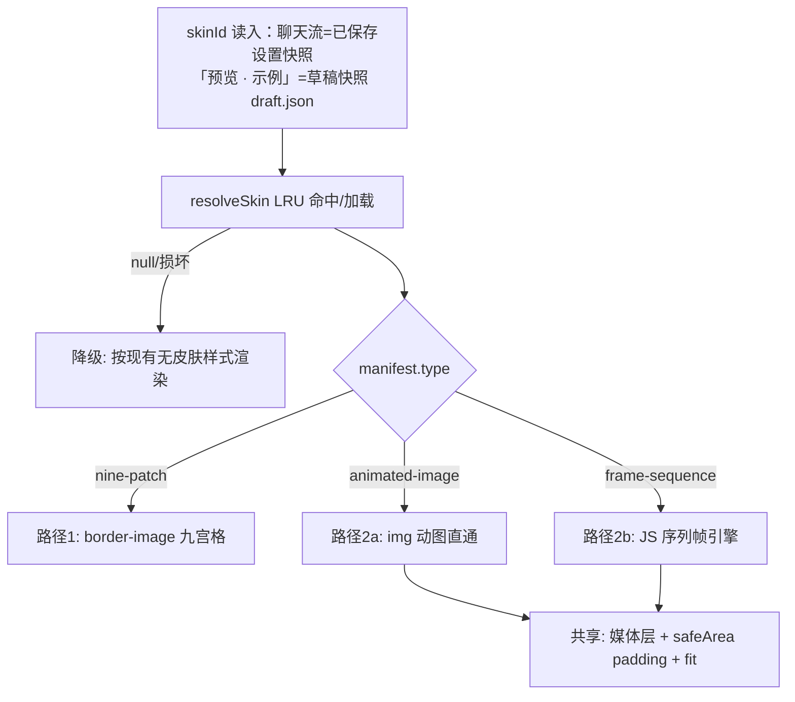

# UI 设计 - dsh-chat-focus - 模块2：皮肤渲染层

## 文档信息

| 项目 | 内容 |
|------|------|
| 模块ID | M2 |
| 创建日期 | 2026-08-17 21:55 |
| 模块类型 | UI 设计（渲染组件）+ 方案轨道（渲染路径） |
| 状态 | 定稿（v1.2.0 修订：适配 v0.2.5 双侧统一 ChatBubble 管线；v1.3.0 修订：border-image 语法与 padding 澄清、描边/圆角让位、帧池共享、LRU 钉住衔接、毛玻璃叠加验证点） |
| 上游 | M1（SkinStore 接口）；总规划 §2（border-image 动图结论）；v0.2.5 统一管线（MessageItem/预览 → ChatBubble role） |

---

## 1. 模块概述

### 1.1 在系统组合中的位置

M2 提供 `SkinBubbleChrome`——唯一负责皮肤气泡外观的渲染组件。调用方：ChatBubble（聊天流唯一气泡组件，v0.2.5 起双侧统一——助手回复与用户消息行 `MessageItem` 均经它渲染）、设置页「预览 · 示例」（草稿快照驱动，§6）、M4 皮肤卡片缩略图。M2 消费 M1 的 `resolveSkin`，按 manifest `type` 分派到两条渲染路径（总规划技术调研结论：Chrome 下 border-image 动图边缘不刷新，两路径必须分离）。

### 1.2 决策记录

| 序号 | 时间戳 | 决策点 | 方案A | 方案B | 方案C | 用户选择 | 选择理由 |
|------|--------|--------|-------|-------|-------|----------|----------|
| 2.1 | 21:48 | 静态皮肤拉伸 | background-size stretch（整图拉伸） | **border-image slice+stretch（原生九宫格）** | CSS Grid 3×3 切块 | 方案B | 角不变形边可重复，QQ 式质感；纯 CSS 零运行时 |
| 2.2 | 21:48 | 动画皮肤渲染 | background-image 动图（无法控速） | **分层：绝对定位媒体层 + 安全区 padding** | canvas 逐帧合成 | 方案B | 动图直通 + 序列帧引擎共用一层结构；内容不与动画争层 |
| 2.3 | 21:49 | 序列帧引擎驱动 | setInterval 换 src | **requestAnimationFrame 时间累积 + 预解码 Image 池换绘制层背景** | CSS steps() 精灵图 | 方案A | 帧间隔精确不受定时器漂移；精灵图要求素材等大拼图，导入成本高 |
| 2.4 | 21:49 | 动画暂停条件 | 永不暂停 | **视口外(IntersectionObserver) + 页面隐藏(visibilitychange) + prefers-reduced-motion（静止首帧）** | 仅页面隐藏 | 方案B | 长会话几十个气泡动画的 CPU/电量控制；reduced-motion 为 WCAG 要求 |
| 2.5 | 21:50 | 皮肤激活时的内容 padding | 用户 padding 字段优先 | **皮肤 safeArea 接管（激活即覆盖，取消即恢复用户值）** | 两者取大值 | 方案B | 决策 #8 让位模型的自然推论；皮肤安全区是设计者意图 |

> L2 决策按已确认的 L0-#3（动图直通+序列帧引擎）与 #8（替换背景层）指引定稿。

### 1.3 消费者清单（原则3）

| 消费者 | 消费方式 |
|--------|---------|
| ChatBubble（双侧统一组件，v0.2.5） | 皮肤激活时背景层改由皮肤渲染路径提供；`role` 只区分头部/对齐，chrome 一条路径 |
| MessageItem 用户消息行 | 与助手侧同一条 `<ChatBubble role="user">` 管线（`MessageItem.tsx:245`），无需独立集成 |
| 设置「预览 · 示例」（M6） | 与聊天同组件实时预览，数据源为**草稿快照**（§6，决策 #10；皮肤 Tab / 气泡弹窗共用） |
| M4 皮肤管理器 | 卡片缩略图（SkinThumb：首帧静态或悬停播放） |

---

## 2. 渲染路径分派



## 3. 路径1：nine-patch（静态图）

效果要求：
- `.content` 应用 `border-image: url(<objectUrl>) <t> <r> <b> <l> fill stretch`（CSS 语法中 `fill` 必须位于 slice 值之后）；slice 值来自 manifest.slices（源图像素）；
- 内容内缩完全由 border-image 边宽承担（slice 为 px 时边宽默认 = slice 值）：激活时 `.content` 的 padding 变量置 0，**避免「边宽 + padding」双重内缩**；用户 padding 字段让位（决策 2.5）；描边与圆角字段一并向皮肤让位（控件禁用并提示，总规划 §6 让位清单 v1.3.0 扩展）——描边与圆角均由素材呈现；
- 制作器文案向用户明示「圆角画进图里」（border-image 不响应 border-radius，见上条让位规则）；
- **气泡尾巴**：尾巴属于素材的一部分，须**完整落在某一条边切片（通常底边）内**，否则中段拉伸会把尾巴拉变形；该约束写入 M3 制作器的标记指引与保存校验（M3 §5）；
- 失败降级：图片解码失败 → 回退无皮肤样式 + console 警告（不白屏，错误边界兜底）。

## 4. 路径2：animated-image / frame-sequence（动画）

DOM 结构（效果描述）：

```text
.bubbleSkinHost (position:relative)
  ├─ .skinMedia (absolute inset:0, z-index:0)   ←  动图 或 帧容器
  └─ .content (position:relative, z-index:1)    ← padding = manifest.safeArea
```

- animated-image：`` 一枚，浏览器原生播放 GIF/APNG/WebP；`object-fit` = manifest.fit 映射（cover→cover、contain→contain、**stretch→fill**；manifest 枚举与设置域 FOCUS_BUBBLE_BG_SIZES 保持一致，见总规划 §5.2）；
- frame-sequence：帧引擎（决策 2.3/2.4）：
  - 帧解码池按 skinId **模块级共享**（SkinFramePool 单例 + 引用计数，v1.3.0）：首个实例预解码全部帧为 Image 对象（≤120 帧，解码后交 GPU 合成），同皮肤多气泡实例复用同一份位图——内存不随实例数翻倍；末个实例卸载后释放池；
  - rAF 循环按 `fps` 时间累积推进帧索引，帧容器换背景（`background-image` 指向预解码池）；
  - 暂停矩阵（决策 2.4）：视口外 / 页面隐藏 / `prefers-reduced-motion: reduce` → 停在首帧，恢复可见即续播；
- 双侧统一集成（v0.2.5 起）：助手回复与用户消息行（`MessageItem`）都直接渲染 `<ChatBubble role>`；皮肤 chrome 接入 ChatBubble 的背景层位置（`.content` 单层背景让位于皮肤路径），不存在第二条用户侧注入链或包裹容器。

## 5. 半透明/遮罩与皮肤的叠加顺序（承接 L0-#2 与 #8）

层级自下而上：**皮肤媒体层 → 背景色（rgba，皮肤激活时为 transparent）→ bgImage/渐变（让位）→ inset overlay 遮罩 → 文字内容**；整体 opacity 与 backdrop-filter 作用于气泡容器整体（含皮肤层）。即 M5 的三控件在皮肤激活时继续生效（毛玻璃作用于皮肤之上）。遮罩走独立 `SkinOverlayLayer`（z 序见总规划 §9 并入正案表），统一管线下双侧共用。

> ⚠ **叠加验证点（v1.3.0）**：整体 opacity ≠ 100% 时 `.bubble` 形成 backdrop root，可能使 `.content` 的 backdrop-filter 采样范围退化为气泡内部而非页面背景——「毛玻璃作用于皮肤之上」的目标表现须经 M5 §3 的前置 spike 实测确认；若采样失效，按 M5 备选方案调整 blur 挂载层级。

## 6. 预览一致性

- SkinBubbleChrome 为纯展示组件：props = `{ record: SkinRecord, paused?: boolean, snapshot?: BubbleSnapshot, children }`；聊天流、设置「预览 · 示例」、卡片缩略图共用同一实现（v0.2.5 统一管线后聊天流与预览本就同构，皮肤层沿用同一接入点）；
- **预览数据源 = 草稿快照（决策 #10）**：「预览 · 示例」以当前草稿值（skinId + 皮肤基础上自定义的叠加参数）驱动 SkinBubbleChrome 与半透明合成——草稿是组件工作副本（内存），经 M1 DraftStore 去抖持久化为 draft.json 缓存文件（文件只负责暂存与恢复，渲染不直接读文件）；聊天流继续消费已保存设置快照。组件不感知来源——`snapshot` 由调用方注入（缺省回落已保存值），「保存」后两路归一，「放弃更改」预览切回已保存快照；
- 卡片缩略图 `SkinThumb` = SkinBubbleChrome 的 `paused` 封装（默认 paused、卡片悬停置 false 播放，M4 决策 4.2），无独立渲染逻辑；

## 7. 失败场景（原则4）

| 场景 | 行为 |
|------|------|
| skinId 指向的皮肤被删除 | resolveSkin 返回 null → 无皮肤样式；已保存残留 id 由 M4「清除」按钮归位；**草稿态**引用被删皮肤时由 M4 删除联动清空草稿 skinId（M4 §5），预览同样按无皮肤降级 |
| 资产对象 URL 失效（LRU 淘汰后组件仍挂载） | 由 M1 钉住语义杜绝：组件挂载即 pin 所引 SkinRecord、卸载 unpin，LRU 仅淘汰未钉住条目；防御性 onerror → 降级样式兜底 |
| 帧解码部分失败 | 已解码帧循环播放，缺帧跳过并计数，console 警告 |
| OPFS 读取异常（临时锁/IO 错误） | 一次重试 → 降级无皮肤 + 警告；不阻塞聊天渲染（渲染层永不 await 阻塞首帧：先渲染无皮肤，资产就绪后补挂） |

## 8. 性能预算

- 同时播放的动画气泡 ≤ 视口内数量（IntersectionObserver 天然限制）；
- 帧引擎内存 = 帧数 × 帧位图；120 帧 512×256 PNG 序列 ≈ 60MB 解码位图上限——制作器保存时展示预估体积，超 10MB 警告（引导减帧/降分辨率，见 M3 §5）；
- LRU 缓存 ≤8 皮肤（M1，钉住语义见 §7），覆盖双侧激活 + 预览 + 管理器浏览；
- backdrop-filter 开销随视口内气泡数线性增长：blur 仅对视口内气泡生效（复用动画暂停矩阵的 IntersectionObserver），视口外不渲染模糊（与 M5 §3 性能预算一致）。
