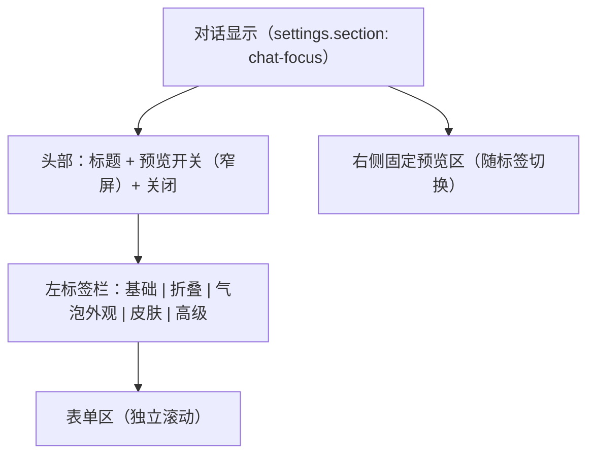

# UI 设计 - dsh-chat-focus - 设置重组与皮肤制作器

> G4 门禁交付物（体验轨）。与 [code-design](code-design-20260909-dsh-chat-focus-气泡皮肤增量.md) 的接口契约双向对齐：
> 本文件每个控件都标注其读写的持久字段；契约侧每个字段都有控件承载。

## 文档信息

| 项目 | 内容 |
|------|------|
| 创建日期 | 2026-09-09 |
| 上游 | feature-design（FEAT-101~112）、solution-design（D1~D8） |
| 状态 | 已定稿（G4） |
| 复用 | 宿主 `Modal` 原语、现有 CSS Modules 令牌体系 |

---

## 1. 设置页信息架构

### 1.1 骨架（FEAT-110）



| 标签 | 承载功能 | 预览内容 |
|------|----------|----------|
| 基础 | 插件开关、气泡开关、气泡密度 | 折叠框 + 助手气泡 |
| 折叠 | 折叠策略、保持展开数、默认展开、摘要、思考收纳 | 折叠框 + 助手气泡 |
| 气泡外观 | 助手/用户分段开关 + 复制到另一侧 + 模板/皮肤选择 + 底纹（色+不透明度+毛玻璃）+ 背景图片/渐变/遮罩 + 文字 + 几何 | 助手气泡 + 用户气泡（长文本，验证拉伸） |
| 皮肤 | 皮肤库网格 + 制作入口 | 助手气泡 + 用户气泡 |
| 高级 | 皮肤库状态、资产存储位置、恢复全部默认设置 | 折叠框 + 助手气泡 + 用户气泡 |

- 标签为**组件私有状态**，不持久化（重开回到「基础」）。
- 宽屏（≥ 860px）：左栏 116px 固定、中间表单独立滚动、右侧预览 300px 常驻；窄屏：标签栏转横向、预览移到表单下方并由头部按钮折叠（`ResizeObserver` 实测容器宽度切换）。
- 表单超出时独立滚动，预览区常驻（沿用现有 `paneHeight` 测量逻辑）。

### 1.2 气泡侧页（助手/用户同构）

四个折叠小节（默认全部展开，`<details>`）：

**① 样式来源**
| 控件 | 字段 | 说明 |
|------|------|------|
| 皮肤选择 | `focusBubbleSkin` / `focusUserBubbleSkin` | 下拉：无（自定义） + 皮肤库条目 + 「去制作…」入口 |
| 模板 | `focusBubblePreset` | 内置配色模板（默认/浅蓝/薄荷绿/渐变/暗夜/纹理），仅影响颜色类字段 |
| 气泡密度 | `focusBubbleStyle`（通用页） | 默认/紧凑 |

**② 底纹（FEAT-101/102）**
| 控件 | 字段 | 说明 |
|------|------|------|
| 背景色 | `focusBubbleBg` | 取色器 + 文本（接受 `#rrggbb` / `#rrggbbaa` / `rgba()`） |
| **底纹不透明度** | `focusBubbleBackdropOpacity` | 滑块 0~100 + 数值；作用于色/图/渐变整体 |
| **毛玻璃** | `focusBubbleBackdropBlur` | 下拉：无 / 弱 / 中 / 强 |
| 背景图片 | `focusBubbleBgImage` | 上传（裁剪）+ URL + 缩略图 + 清除 |
| 适配 / 对齐 | `focusBubbleBgSize` / `focusBubbleBgPosition` | 下拉 |
| 渐变 | `focusBubbleGradientFrom/To/Angle` | 启用开关 + 双取色 + 角度 |
| 遮罩 | `focusBubbleOverlay` | 滑块 −100~+100（文字可读性），紧邻背景图片下方 |

**③ 文字**
| 控件 | 字段 |
|------|------|
| 文字颜色 | `focusBubbleTextColor` |
| 字体 | `focusBubbleFont` |
| 字号 | `focusBubbleFontSize` |
| 内边距 | `focusBubblePadding` |

**④ 几何**
| 控件 | 字段 |
|------|------|
| 圆角 | `focusBubbleRadius` |
| 最大宽度 | `focusBubbleMaxWidth` |
| 恢复默认（本节） | 重置该侧全部字段 |

**皮肤接管态**：`focusBubbleSkin ≠ ''` 时，②「底纹」与④「圆角」控件置灰并显示说明条：
「已由皮肤「<名称>」接管——背景色/图片/渐变/圆角不再生效；删除皮肤或选择「无」可恢复。」
③ 文字小节保持可用（皮肤未定义文字颜色时使用用户值）。

### 1.3 皮肤页（FEAT-107）

```
┌ 皮肤 ─────────────────────────────────────────────┐
│ [+ 制作新皮肤]                                     │
│ ┌────────┐ ┌────────┐ ┌────────┐                  │
│ │ 缩略图  │ │ 缩略图  │ │ 缩略图  │   ← 网格 3 列    │
│ │ 名称    │ │ 名称    │ │ 名称    │                 │
│ │ 徽标    │ │ 徽标    │ │ 徽标    │                 │
│ │ 应用·改名·删除 │ …  │ …     │                 │
│ └────────┘ └────────┘ └────────┘                  │
└────────────────────────────────────────────────────┘
```
- 徽标：`静态` / `动画` / `精灵 N 帧` / `内置`。
- 应用按钮：下拉「应用到助手 / 用户 / 两者」。
- 内置皮肤标记为只读（无改名/删除）。
- 空态：一句说明 + 制作按钮。

## 2. 皮肤制作器（模态向导）

### 2.1 步骤骨架

```
① 选素材 ──▶ ② 处理素材 ──▶ ③ 切片与几何 ──▶ ④ 文字与预览 ──▶ ⑤ 保存并应用
   │             │                │                 │
   └ 多文件/视频/图片自动分流 ─────┘                 └ 名称 + 应用目标
```
- 顶部：步骤指示器（当前步高亮，已完成步可点击回退）。
- 底部：`上一步` / `下一步`（末步为 `保存并应用`）/ `取消`。
- 右侧：**实时预览**（固定，占 40% 宽），始终显示「短 / 中 / 长」三档内容的气泡。
- 素材与中间产物保留在向导状态中，回退不丢失。

### 2.2 各步布局

**① 选素材**
- 拖拽区 + 「选择文件」按钮；提示接受的格式与体积上限。
- 识别结果卡片：类型徽标、尺寸、帧数（若动态）、体积。
- 多文件时显示序列帧列表（文件名 + 缩略图 + 移除按钮 + 拖拽排序）。

**② 处理素材**
- 静态/动画图片：显示原图与「无需转换」说明，可选「缩放到 ≤N px」。
- 视频：帧数（4~60）、帧宽（120~480）、起点/时长 → 「抽取帧」按钮 → 进度条（第 i/N 帧）。
- 序列帧：帧率（1~30）、帧宽 → 「合成精灵图」按钮 → 进度条。
- 产出预览：精灵图横向缩略 + 「N 帧 · fps」标注。

**③ 切片与几何**
- 素材画布（等比适配显示），四条参考线可拖拽，线外半透明遮罩标示切片区。
- 数值输入：左/上/右/下（px）；「按内容自动估算」按钮。
- 内容内边距：默认 = 切片内缩量，可解锁手动调整。
- **动态图片 / 精灵 / 视频类素材**：跳过参考线（步骤指示器标注「整层」），改为「圆角」滑块 + 「适配（覆盖/拉伸）」下拉 + 说明（动态素材整层绘制）。

**④ 文字与预览**
- 文字颜色（取色器 + 文本）、字号预设。
- 预览区三档长度实时跟随。

**⑤ 保存并应用**
- 名称输入（默认「皮肤 2026-09-09 14:30」）。
- 应用目标：助手 / 用户 / 两者 / 仅保存。
- 保存中：按钮禁用 + 转圈；失败：内联错误文案，保留向导状态。

### 2.3 视觉规范

| 元素 | 规范 |
|------|------|
| 向导宽度 | `min(920px, 92vw)`，高度 `max-height: 88vh` |
| 左栏（步骤内容） | 60% 宽，独立滚动 |
| 右栏（预览） | 36% 宽，`--dsw-alias-bg-layer-2` 底，顶部粘性标签 |
| 切片参考线 | 1px 实线 `--dsw-static-deepseek-500`，拖拽热区 8px |
| 遮罩 | `rgba(0,0,0,.45)`，切片区外覆盖 |
| 进度条 | 4px 高圆角条，宿主强调色 |
| 徽标 | 11px 圆角胶囊，`--dsw-alias-bg-layer-3` 底 |

## 3. 控件清单（复用与新增）

| 控件 | 来源 | 变更 |
|------|------|------|
| `Row` / `Checkbox` / `ColorField` / `PresetSelect` / `FontSelect` | 现有 | 抽取到 `settings/controls.tsx` 共享 |
| `Slider`（不透明度/遮罩） | 现有 range 输入 | 抽取为 `SliderRow` |
| `Tabs` | 新增 | 页签骨架 |
| `SkinCard` / `SkinGrid` | 新增 | 皮肤库 |
| `SliceEditor` | 新增 | 九宫格参考线编辑 |
| `SpriteStrip` | 新增 | 精灵图缩略与帧标注 |
| `ProgressBar` | 新增 | 抽帧/合成进度 |

## 4. 与契约的对齐检查（WF-003）

| UI 控件 | 持久字段 | 契约定义位置 | 对齐 |
|---------|----------|--------------|------|
| 底纹不透明度滑块 | `focusBubbleBackdropOpacity` / `focusUserBubbleBackdropOpacity` | chat-settings.ts | ✅ |
| 毛玻璃下拉 | `focusBubbleBackdropBlur` / `focusUserBubbleBackdropBlur` | chat-settings.ts | ✅ |
| 皮肤选择 | `focusBubbleSkin` / `focusUserBubbleSkin` | chat-settings.ts | ✅ |
| 皮肤库列表/保存/删除 | 宿主 RPC `skins.list/save/delete` | code-design §4.1 | ✅ |
| 素材 URL | `GET /api/chat-focus/skin-asset?id=&v=` | code-design §4.2 | ✅ |
| 预览三档长度 | 组件内冻结样例 | — | ✅ |

## 5. 变更记录（D6′/D8′，2026-09-09 用户裁决）

### 5.1 设置页布局：顶部四页签 → 左标签栏 + 右侧固定预览

| 区域 | 规格 |
|------|------|
| 容器 | `display: flex` 三栏：`.tabRail`（116px 固定）+ `.formPane`（`flex: 1`，独立纵向滚动）+ `.previewAside`（300px 固定） |
| 标签栏 | 五标签：基础 / 折叠 / 气泡外观 / 皮肤 / 高级；纵向排列，选中态为宿主 `--dsw-alias-bg-base` + 1px 投影 |
| 预览栏 | 常驻右侧，`overflow-y: auto`；随标签切换内容（基础/折叠/高级 → 折叠框 + 助手气泡；外观/皮肤 → 助手 + 用户气泡） |
| 窄屏（< 860px） | 由 `ResizeObserver` 实测容器宽度触发：标签栏转横向（`flex-direction: row; flex-wrap: wrap`），预览移到表单下方并通过头部「展开/收起预览」按钮折叠 |
| 高度 | 沿用宿主滚动祖先测量（`paneHeight`），`box-sizing: border-box`，三栏共享该高度 |

### 5.2 气泡外观：助手/用户分段开关 + 复制到另一侧

| 控件 | 规格 |
|------|------|
| 分段开关 | 两枚按钮（助手 / 用户），`role="tab"` + `aria-selected`；切换只换 `side` 参数，控件集合不变 |
| 复制到另一侧 | 次级按钮；把本侧 19 个字段（含皮肤 id）一次原子写入另一侧；无变化时不写 |
| 接管提示 | 皮肤库不可用时在编辑器上方显示一次说明（不再逐行置灰提示） |

### 5.3 高级页

| 区块 | 内容 |
|------|------|
| 皮肤库状态 | 已连接 / 正在连接 / 尚未加载 / 不可用 + 自制皮肤数量 + 重试按钮 + 错误原因 |
| 资产位置 | `~/.dsh/chat-focus/skins/`（说明跨浏览器可用、删目录即清空） |
| 恢复全部默认设置 | 二次确认后一次原子写入全部 `focus*` 字段 |

### 5.4 制作器：视频双路线（FEAT-111）

| 元素 | 规格 |
|------|------|
| 处理方式下拉 | 「抽帧合成精灵图（推荐）」/「直接使用视频（运行时播放）」，默认抽帧 |
| 抽帧路线 | 保留原参数（帧宽 / 帧率 / 帧数）+ 进度与取消 |
| 直用路线 | 显示静音循环 `<video>` 预览 + 性能提示（视口内解码、≤ 8MB） |
| 几何步 | 视频与动画图一致：圆角 + 适配（覆盖 / 拉伸），不做九宫格切片 |
